# Предсказание уровня удволетворенности сотрудника

Цель данной задачи: построить модель, предсказывающую уровень удволетворённости сотрудника (признак в диапазоне от 0 до 1) по имеющимся данным. По требованию заказщика, модель должна быть оценена метрикой SMAPE (описаниениже в проекте)

## Загрузка данных


```python
!pip install phik
!pip install -U scikit-learn   
!pip install shap
!pip install matplotlib==3.5.0 -q
```

    Collecting phik
      Downloading phik-0.12.4-cp39-cp39-manylinux_2_17_x86_64.manylinux2014_x86_64.whl (686 kB)
         |████████████████████████████████| 686 kB 2.6 MB/s eta 0:00:01
    [?25hRequirement already satisfied: pandas>=0.25.1 in /opt/conda/lib/python3.9/site-packages (from phik) (1.2.4)
    Requirement already satisfied: scipy>=1.5.2 in /opt/conda/lib/python3.9/site-packages (from phik) (1.9.1)
    Requirement already satisfied: joblib>=0.14.1 in /opt/conda/lib/python3.9/site-packages (from phik) (1.1.0)
    Requirement already satisfied: numpy>=1.18.0 in /opt/conda/lib/python3.9/site-packages (from phik) (1.21.1)
    Requirement already satisfied: matplotlib>=2.2.3 in /opt/conda/lib/python3.9/site-packages (from phik) (3.3.4)
    Requirement already satisfied: kiwisolver>=1.0.1 in /opt/conda/lib/python3.9/site-packages (from matplotlib>=2.2.3->phik) (1.4.4)
    Requirement already satisfied: pillow>=6.2.0 in /opt/conda/lib/python3.9/site-packages (from matplotlib>=2.2.3->phik) (8.4.0)
    Requirement already satisfied: pyparsing!=2.0.4,!=2.1.2,!=2.1.6,>=2.0.3 in /opt/conda/lib/python3.9/site-packages (from matplotlib>=2.2.3->phik) (2.4.7)
    Requirement already satisfied: python-dateutil>=2.1 in /opt/conda/lib/python3.9/site-packages (from matplotlib>=2.2.3->phik) (2.8.1)
    Requirement already satisfied: cycler>=0.10 in /opt/conda/lib/python3.9/site-packages (from matplotlib>=2.2.3->phik) (0.11.0)
    Requirement already satisfied: pytz>=2017.3 in /opt/conda/lib/python3.9/site-packages (from pandas>=0.25.1->phik) (2021.1)
    Requirement already satisfied: six>=1.5 in /opt/conda/lib/python3.9/site-packages (from python-dateutil>=2.1->matplotlib>=2.2.3->phik) (1.16.0)
    Installing collected packages: phik
    Successfully installed phik-0.12.4
    Requirement already satisfied: scikit-learn in /opt/conda/lib/python3.9/site-packages (0.24.1)
    Collecting scikit-learn
      Downloading scikit_learn-1.5.2-cp39-cp39-manylinux_2_17_x86_64.manylinux2014_x86_64.whl (13.4 MB)
         |████████████████████████████████| 13.4 MB 1.4 MB/s eta 0:00:01
    [?25hRequirement already satisfied: numpy>=1.19.5 in /opt/conda/lib/python3.9/site-packages (from scikit-learn) (1.21.1)
    Requirement already satisfied: threadpoolctl>=3.1.0 in /opt/conda/lib/python3.9/site-packages (from scikit-learn) (3.1.0)
    Collecting joblib>=1.2.0
      Downloading joblib-1.4.2-py3-none-any.whl (301 kB)
         |████████████████████████████████| 301 kB 71.8 MB/s eta 0:00:01
    [?25hRequirement already satisfied: scipy>=1.6.0 in /opt/conda/lib/python3.9/site-packages (from scikit-learn) (1.9.1)
    Installing collected packages: joblib, scikit-learn
      Attempting uninstall: joblib
        Found existing installation: joblib 1.1.0
        Uninstalling joblib-1.1.0:
          Successfully uninstalled joblib-1.1.0
      Attempting uninstall: scikit-learn
        Found existing installation: scikit-learn 0.24.1
        Uninstalling scikit-learn-0.24.1:
          Successfully uninstalled scikit-learn-0.24.1
    Successfully installed joblib-1.4.2 scikit-learn-1.5.2
    Collecting shap
      Downloading shap-0.46.0-cp39-cp39-manylinux_2_12_x86_64.manylinux2010_x86_64.manylinux_2_17_x86_64.manylinux2014_x86_64.whl (539 kB)
         |████████████████████████████████| 539 kB 2.0 MB/s eta 0:00:01
    [?25hRequirement already satisfied: packaging>20.9 in /opt/conda/lib/python3.9/site-packages (from shap) (21.3)
    Collecting slicer==0.0.8
      Downloading slicer-0.0.8-py3-none-any.whl (15 kB)
    Requirement already satisfied: pandas in /opt/conda/lib/python3.9/site-packages (from shap) (1.2.4)
    Requirement already satisfied: scikit-learn in /opt/conda/lib/python3.9/site-packages (from shap) (1.5.2)
    Requirement already satisfied: numba in /opt/conda/lib/python3.9/site-packages (from shap) (0.56.0)
    Requirement already satisfied: tqdm>=4.27.0 in /opt/conda/lib/python3.9/site-packages (from shap) (4.61.2)
    Requirement already satisfied: scipy in /opt/conda/lib/python3.9/site-packages (from shap) (1.9.1)
    Collecting cloudpickle
      Downloading cloudpickle-3.1.0-py3-none-any.whl (22 kB)
    Requirement already satisfied: numpy in /opt/conda/lib/python3.9/site-packages (from shap) (1.21.1)
    Requirement already satisfied: pyparsing!=3.0.5,>=2.0.2 in /opt/conda/lib/python3.9/site-packages (from packaging>20.9->shap) (2.4.7)
    Requirement already satisfied: setuptools in /opt/conda/lib/python3.9/site-packages (from numba->shap) (49.6.0.post20210108)
    Requirement already satisfied: llvmlite<0.40,>=0.39.0dev0 in /opt/conda/lib/python3.9/site-packages (from numba->shap) (0.39.0)
    Requirement already satisfied: python-dateutil>=2.7.3 in /opt/conda/lib/python3.9/site-packages (from pandas->shap) (2.8.1)
    Requirement already satisfied: pytz>=2017.3 in /opt/conda/lib/python3.9/site-packages (from pandas->shap) (2021.1)
    Requirement already satisfied: six>=1.5 in /opt/conda/lib/python3.9/site-packages (from python-dateutil>=2.7.3->pandas->shap) (1.16.0)
    Requirement already satisfied: joblib>=1.2.0 in /opt/conda/lib/python3.9/site-packages (from scikit-learn->shap) (1.4.2)
    Requirement already satisfied: threadpoolctl>=3.1.0 in /opt/conda/lib/python3.9/site-packages (from scikit-learn->shap) (3.1.0)
    Installing collected packages: slicer, cloudpickle, shap
    Successfully installed cloudpickle-3.1.0 shap-0.46.0 slicer-0.0.8


```python
# импорт необходимых библиотек
import warnings

import pandas as pd
import matplotlib.pyplot as plt
import seaborn as sns
import numpy as np
from phik import report
from phik.report import plot_correlation_matrix

from sklearn.preprocessing import OneHotEncoder, OrdinalEncoder, RobustScaler,MinMaxScaler, StandardScaler, LabelEncoder


from sklearn.metrics import make_scorer, roc_auc_score

from sklearn.impute import SimpleImputer

from sklearn.pipeline import Pipeline
from sklearn.compose import ColumnTransformer

from sklearn.model_selection import KFold

from sklearn.linear_model import LinearRegression, Lasso, Ridge
from sklearn.tree import DecisionTreeClassifier, DecisionTreeRegressor
from sklearn.svm import SVC
from sklearn.neighbors import KNeighborsClassifier

from sklearn.model_selection import train_test_split, GridSearchCV, RandomizedSearchCV

from sklearn.inspection import permutation_importance

import shap

from matplotlib.colors import ListedColormap


RANDOM_STATE = 42
TEST_SIZE = 0.25

pd.options.mode.chained_assignment = None
warnings.filterwarnings('ignore')

plt.rcParams ['figure.figsize'] = [16, 8]
```


```python
sat_df = pd.read_csv('/datasets/train_job_satisfaction_rate.csv')# тренировочные данные
test_features_df = pd.read_csv('/datasets/test_features.csv')# входные признаки тестовой выборки
test_rate_df = pd.read_csv('/datasets/test_target_job_satisfaction_rate.csv')# целевые признаки тестовой выборки
```

## Предобработка данных

### Тренировочная выборка


```python
sat_df.info()
sat_df.head()
```

    <class 'pandas.core.frame.DataFrame'>
    RangeIndex: 4000 entries, 0 to 3999
    Data columns (total 10 columns):
     #   Column                 Non-Null Count  Dtype  
    ---  ------                 --------------  -----  
     0   id                     4000 non-null   int64  
     1   dept                   3994 non-null   object 
     2   level                  3996 non-null   object 
     3   workload               4000 non-null   object 
     4   employment_years       4000 non-null   int64  
     5   last_year_promo        4000 non-null   object 
     6   last_year_violations   4000 non-null   object 
     7   supervisor_evaluation  4000 non-null   int64  
     8   salary                 4000 non-null   int64  
     9   job_satisfaction_rate  4000 non-null   float64
    dtypes: float64(1), int64(4), object(5)
    memory usage: 312.6+ KB


<div>
<style scoped>
    .dataframe tbody tr th:only-of-type {
        vertical-align: middle;
    }

    .dataframe tbody tr th {
        vertical-align: top;
    }

    .dataframe thead th {
        text-align: right;
    }
</style>
<table border="1" class="dataframe">
  <thead>
    <tr style="text-align: right;">
      <th></th>
      <th>id</th>
      <th>dept</th>
      <th>level</th>
      <th>workload</th>
      <th>employment_years</th>
      <th>last_year_promo</th>
      <th>last_year_violations</th>
      <th>supervisor_evaluation</th>
      <th>salary</th>
      <th>job_satisfaction_rate</th>
    </tr>
  </thead>
  <tbody>
    <tr>
      <th>0</th>
      <td>155278</td>
      <td>sales</td>
      <td>junior</td>
      <td>medium</td>
      <td>2</td>
      <td>no</td>
      <td>no</td>
      <td>1</td>
      <td>24000</td>
      <td>0.58</td>
    </tr>
    <tr>
      <th>1</th>
      <td>653870</td>
      <td>hr</td>
      <td>junior</td>
      <td>high</td>
      <td>2</td>
      <td>no</td>
      <td>no</td>
      <td>5</td>
      <td>38400</td>
      <td>0.76</td>
    </tr>
    <tr>
      <th>2</th>
      <td>184592</td>
      <td>sales</td>
      <td>junior</td>
      <td>low</td>
      <td>1</td>
      <td>no</td>
      <td>no</td>
      <td>2</td>
      <td>12000</td>
      <td>0.11</td>
    </tr>
    <tr>
      <th>3</th>
      <td>171431</td>
      <td>technology</td>
      <td>junior</td>
      <td>low</td>
      <td>4</td>
      <td>no</td>
      <td>no</td>
      <td>2</td>
      <td>18000</td>
      <td>0.37</td>
    </tr>
    <tr>
      <th>4</th>
      <td>693419</td>
      <td>hr</td>
      <td>junior</td>
      <td>medium</td>
      <td>1</td>
      <td>no</td>
      <td>no</td>
      <td>3</td>
      <td>22800</td>
      <td>0.20</td>
    </tr>
  </tbody>
</table>
</div>


Видно, что есть пропуски в стобцах *debt* и *level*. посмотрим на эти пропуски


```python
sat_df.query('dept.isna()')
```


<div>
<style scoped>
    .dataframe tbody tr th:only-of-type {
        vertical-align: middle;
    }

    .dataframe tbody tr th {
        vertical-align: top;
    }

    .dataframe thead th {
        text-align: right;
    }
</style>
<table border="1" class="dataframe">
  <thead>
    <tr style="text-align: right;">
      <th></th>
      <th>id</th>
      <th>dept</th>
      <th>level</th>
      <th>workload</th>
      <th>employment_years</th>
      <th>last_year_promo</th>
      <th>last_year_violations</th>
      <th>supervisor_evaluation</th>
      <th>salary</th>
      <th>job_satisfaction_rate</th>
    </tr>
  </thead>
  <tbody>
    <tr>
      <th>1526</th>
      <td>694746</td>
      <td>NaN</td>
      <td>junior</td>
      <td>medium</td>
      <td>5</td>
      <td>no</td>
      <td>no</td>
      <td>4</td>
      <td>21600</td>
      <td>0.62</td>
    </tr>
    <tr>
      <th>1630</th>
      <td>814624</td>
      <td>NaN</td>
      <td>junior</td>
      <td>medium</td>
      <td>3</td>
      <td>no</td>
      <td>no</td>
      <td>4</td>
      <td>24000</td>
      <td>0.88</td>
    </tr>
    <tr>
      <th>1633</th>
      <td>475114</td>
      <td>NaN</td>
      <td>junior</td>
      <td>high</td>
      <td>4</td>
      <td>no</td>
      <td>no</td>
      <td>4</td>
      <td>31200</td>
      <td>0.63</td>
    </tr>
    <tr>
      <th>2781</th>
      <td>497243</td>
      <td>NaN</td>
      <td>junior</td>
      <td>medium</td>
      <td>1</td>
      <td>no</td>
      <td>no</td>
      <td>3</td>
      <td>26400</td>
      <td>0.28</td>
    </tr>
    <tr>
      <th>2975</th>
      <td>168668</td>
      <td>NaN</td>
      <td>junior</td>
      <td>low</td>
      <td>3</td>
      <td>no</td>
      <td>no</td>
      <td>4</td>
      <td>18000</td>
      <td>0.88</td>
    </tr>
    <tr>
      <th>3866</th>
      <td>641150</td>
      <td>NaN</td>
      <td>junior</td>
      <td>low</td>
      <td>3</td>
      <td>no</td>
      <td>yes</td>
      <td>4</td>
      <td>12000</td>
      <td>0.54</td>
    </tr>
  </tbody>
</table>
</div>


```python
display(sat_df.query('level.isna()'))
```


<div>
<style scoped>
    .dataframe tbody tr th:only-of-type {
        vertical-align: middle;
    }

    .dataframe tbody tr th {
        vertical-align: top;
    }

    .dataframe thead th {
        text-align: right;
    }
</style>
<table border="1" class="dataframe">
  <thead>
    <tr style="text-align: right;">
      <th></th>
      <th>id</th>
      <th>dept</th>
      <th>level</th>
      <th>workload</th>
      <th>employment_years</th>
      <th>last_year_promo</th>
      <th>last_year_violations</th>
      <th>supervisor_evaluation</th>
      <th>salary</th>
      <th>job_satisfaction_rate</th>
    </tr>
  </thead>
  <tbody>
    <tr>
      <th>1209</th>
      <td>631073</td>
      <td>sales</td>
      <td>NaN</td>
      <td>medium</td>
      <td>1</td>
      <td>no</td>
      <td>no</td>
      <td>4</td>
      <td>27600</td>
      <td>0.66</td>
    </tr>
    <tr>
      <th>1469</th>
      <td>416327</td>
      <td>sales</td>
      <td>NaN</td>
      <td>low</td>
      <td>1</td>
      <td>no</td>
      <td>no</td>
      <td>5</td>
      <td>18000</td>
      <td>0.73</td>
    </tr>
    <tr>
      <th>1745</th>
      <td>135043</td>
      <td>sales</td>
      <td>NaN</td>
      <td>medium</td>
      <td>1</td>
      <td>no</td>
      <td>no</td>
      <td>3</td>
      <td>26400</td>
      <td>0.30</td>
    </tr>
    <tr>
      <th>2522</th>
      <td>998838</td>
      <td>sales</td>
      <td>NaN</td>
      <td>medium</td>
      <td>1</td>
      <td>no</td>
      <td>no</td>
      <td>5</td>
      <td>27600</td>
      <td>0.71</td>
    </tr>
  </tbody>
</table>
</div>


Как мы видим, это не полностью пустые строки, а просто строки с неполными данными (возможно, это недостаток данных, а возможно, стажёры/люди, которых ещё не определили в определенный отдел). Оставим всё как есть(*заполнение пропусков в рамках задания требуется выполнить в пайплайне*)

Проверим категориальные столбцы на неявные дубликаты


```python
for col in sat_df.select_dtypes('object').columns.tolist():
    print(col, sat_df[col].unique())

sat_df['level'] = sat_df['level'].replace('sinior', 'senior')
```

    dept ['sales' 'hr' 'technology' 'purchasing' 'marketing' nan]
    level ['junior' 'middle' 'sinior' nan]
    workload ['medium' 'high' 'low']
    last_year_promo ['no' 'yes']
    last_year_violations ['no' 'yes']


Неявных дубликатов не обнаружено


```python
sat_df = sat_df.drop_duplicates()
sat_df.info()
```

    <class 'pandas.core.frame.DataFrame'>
    Int64Index: 4000 entries, 0 to 3999
    Data columns (total 10 columns):
     #   Column                 Non-Null Count  Dtype  
    ---  ------                 --------------  -----  
     0   id                     4000 non-null   int64  
     1   dept                   3994 non-null   object 
     2   level                  3996 non-null   object 
     3   workload               4000 non-null   object 
     4   employment_years       4000 non-null   int64  
     5   last_year_promo        4000 non-null   object 
     6   last_year_violations   4000 non-null   object 
     7   supervisor_evaluation  4000 non-null   int64  
     8   salary                 4000 non-null   int64  
     9   job_satisfaction_rate  4000 non-null   float64
    dtypes: float64(1), int64(4), object(5)
    memory usage: 343.8+ KB


Полных дубликатов также не обнаружено

Теперь назначим индексом строки id сотрудника


```python
sat_df = sat_df.set_index('id')
sat_df.head()
```


<div>
<style scoped>
    .dataframe tbody tr th:only-of-type {
        vertical-align: middle;
    }

    .dataframe tbody tr th {
        vertical-align: top;
    }

    .dataframe thead th {
        text-align: right;
    }
</style>
<table border="1" class="dataframe">
  <thead>
    <tr style="text-align: right;">
      <th></th>
      <th>dept</th>
      <th>level</th>
      <th>workload</th>
      <th>employment_years</th>
      <th>last_year_promo</th>
      <th>last_year_violations</th>
      <th>supervisor_evaluation</th>
      <th>salary</th>
      <th>job_satisfaction_rate</th>
    </tr>
    <tr>
      <th>id</th>
      <th></th>
      <th></th>
      <th></th>
      <th></th>
      <th></th>
      <th></th>
      <th></th>
      <th></th>
      <th></th>
    </tr>
  </thead>
  <tbody>
    <tr>
      <th>155278</th>
      <td>sales</td>
      <td>junior</td>
      <td>medium</td>
      <td>2</td>
      <td>no</td>
      <td>no</td>
      <td>1</td>
      <td>24000</td>
      <td>0.58</td>
    </tr>
    <tr>
      <th>653870</th>
      <td>hr</td>
      <td>junior</td>
      <td>high</td>
      <td>2</td>
      <td>no</td>
      <td>no</td>
      <td>5</td>
      <td>38400</td>
      <td>0.76</td>
    </tr>
    <tr>
      <th>184592</th>
      <td>sales</td>
      <td>junior</td>
      <td>low</td>
      <td>1</td>
      <td>no</td>
      <td>no</td>
      <td>2</td>
      <td>12000</td>
      <td>0.11</td>
    </tr>
    <tr>
      <th>171431</th>
      <td>technology</td>
      <td>junior</td>
      <td>low</td>
      <td>4</td>
      <td>no</td>
      <td>no</td>
      <td>2</td>
      <td>18000</td>
      <td>0.37</td>
    </tr>
    <tr>
      <th>693419</th>
      <td>hr</td>
      <td>junior</td>
      <td>medium</td>
      <td>1</td>
      <td>no</td>
      <td>no</td>
      <td>3</td>
      <td>22800</td>
      <td>0.20</td>
    </tr>
  </tbody>
</table>
</div>


### Тестовая выборка

Теперь проведём предобработку тестовой выборки


```python
display(test_features_df.head())
display(test_rate_df.head())
```


<div>
<style scoped>
    .dataframe tbody tr th:only-of-type {
        vertical-align: middle;
    }

    .dataframe tbody tr th {
        vertical-align: top;
    }

    .dataframe thead th {
        text-align: right;
    }
</style>
<table border="1" class="dataframe">
  <thead>
    <tr style="text-align: right;">
      <th></th>
      <th>id</th>
      <th>dept</th>
      <th>level</th>
      <th>workload</th>
      <th>employment_years</th>
      <th>last_year_promo</th>
      <th>last_year_violations</th>
      <th>supervisor_evaluation</th>
      <th>salary</th>
    </tr>
  </thead>
  <tbody>
    <tr>
      <th>0</th>
      <td>485046</td>
      <td>marketing</td>
      <td>junior</td>
      <td>medium</td>
      <td>2</td>
      <td>no</td>
      <td>no</td>
      <td>5</td>
      <td>28800</td>
    </tr>
    <tr>
      <th>1</th>
      <td>686555</td>
      <td>hr</td>
      <td>junior</td>
      <td>medium</td>
      <td>1</td>
      <td>no</td>
      <td>no</td>
      <td>4</td>
      <td>30000</td>
    </tr>
    <tr>
      <th>2</th>
      <td>467458</td>
      <td>sales</td>
      <td>middle</td>
      <td>low</td>
      <td>5</td>
      <td>no</td>
      <td>no</td>
      <td>4</td>
      <td>19200</td>
    </tr>
    <tr>
      <th>3</th>
      <td>418655</td>
      <td>sales</td>
      <td>middle</td>
      <td>low</td>
      <td>6</td>
      <td>no</td>
      <td>no</td>
      <td>4</td>
      <td>19200</td>
    </tr>
    <tr>
      <th>4</th>
      <td>789145</td>
      <td>hr</td>
      <td>middle</td>
      <td>medium</td>
      <td>5</td>
      <td>no</td>
      <td>no</td>
      <td>5</td>
      <td>40800</td>
    </tr>
  </tbody>
</table>
</div>


<div>
<style scoped>
    .dataframe tbody tr th:only-of-type {
        vertical-align: middle;
    }

    .dataframe tbody tr th {
        vertical-align: top;
    }

    .dataframe thead th {
        text-align: right;
    }
</style>
<table border="1" class="dataframe">
  <thead>
    <tr style="text-align: right;">
      <th></th>
      <th>id</th>
      <th>job_satisfaction_rate</th>
    </tr>
  </thead>
  <tbody>
    <tr>
      <th>0</th>
      <td>130604</td>
      <td>0.74</td>
    </tr>
    <tr>
      <th>1</th>
      <td>825977</td>
      <td>0.75</td>
    </tr>
    <tr>
      <th>2</th>
      <td>418490</td>
      <td>0.60</td>
    </tr>
    <tr>
      <th>3</th>
      <td>555320</td>
      <td>0.72</td>
    </tr>
    <tr>
      <th>4</th>
      <td>826430</td>
      <td>0.08</td>
    </tr>
  </tbody>
</table>
</div>


Проверим пропуски


```python
test_features_df.info()
test_rate_df.info()
```

    <class 'pandas.core.frame.DataFrame'>
    RangeIndex: 2000 entries, 0 to 1999
    Data columns (total 9 columns):
     #   Column                 Non-Null Count  Dtype 
    ---  ------                 --------------  ----- 
     0   id                     2000 non-null   int64 
     1   dept                   1998 non-null   object
     2   level                  1999 non-null   object
     3   workload               2000 non-null   object
     4   employment_years       2000 non-null   int64 
     5   last_year_promo        2000 non-null   object
     6   last_year_violations   2000 non-null   object
     7   supervisor_evaluation  2000 non-null   int64 
     8   salary                 2000 non-null   int64 
    dtypes: int64(4), object(5)
    memory usage: 140.8+ KB
    <class 'pandas.core.frame.DataFrame'>
    RangeIndex: 2000 entries, 0 to 1999
    Data columns (total 2 columns):
     #   Column                 Non-Null Count  Dtype  
    ---  ------                 --------------  -----  
     0   id                     2000 non-null   int64  
     1   job_satisfaction_rate  2000 non-null   float64
    dtypes: float64(1), int64(1)
    memory usage: 31.4 KB


2 человека без отдела и 1 без уровня должности.

Теперь проверим данные на дубликаты


```python
for col in test_features_df.select_dtypes('object').columns.tolist():
    print(col, test_features_df[col].unique())

test_features_df['level'] = test_features_df['level'].replace('sinior', 'senior')
```

    dept ['marketing' 'hr' 'sales' 'purchasing' 'technology' nan ' ']
    level ['junior' 'middle' 'sinior' nan]
    workload ['medium' 'low' 'high' ' ']
    last_year_promo ['no' 'yes']
    last_year_violations ['no' 'yes']


Обнаружены пустые значения в столбцах *dept* и *workload*, посмотрим


```python
display(test_features_df.query('dept == " "'))
display(test_features_df.query('workload == " "'))
```


<div>
<style scoped>
    .dataframe tbody tr th:only-of-type {
        vertical-align: middle;
    }

    .dataframe tbody tr th {
        vertical-align: top;
    }

    .dataframe thead th {
        text-align: right;
    }
</style>
<table border="1" class="dataframe">
  <thead>
    <tr style="text-align: right;">
      <th></th>
      <th>id</th>
      <th>dept</th>
      <th>level</th>
      <th>workload</th>
      <th>employment_years</th>
      <th>last_year_promo</th>
      <th>last_year_violations</th>
      <th>supervisor_evaluation</th>
      <th>salary</th>
    </tr>
  </thead>
  <tbody>
    <tr>
      <th>1699</th>
      <td>822186</td>
      <td></td>
      <td>middle</td>
      <td>medium</td>
      <td>3</td>
      <td>no</td>
      <td>no</td>
      <td>4</td>
      <td>38400</td>
    </tr>
  </tbody>
</table>
</div>


<div>
<style scoped>
    .dataframe tbody tr th:only-of-type {
        vertical-align: middle;
    }

    .dataframe tbody tr th {
        vertical-align: top;
    }

    .dataframe thead th {
        text-align: right;
    }
</style>
<table border="1" class="dataframe">
  <thead>
    <tr style="text-align: right;">
      <th></th>
      <th>id</th>
      <th>dept</th>
      <th>level</th>
      <th>workload</th>
      <th>employment_years</th>
      <th>last_year_promo</th>
      <th>last_year_violations</th>
      <th>supervisor_evaluation</th>
      <th>salary</th>
    </tr>
  </thead>
  <tbody>
    <tr>
      <th>15</th>
      <td>590867</td>
      <td>marketing</td>
      <td>junior</td>
      <td></td>
      <td>4</td>
      <td>no</td>
      <td>no</td>
      <td>4</td>
      <td>28800</td>
    </tr>
  </tbody>
</table>
</div>


Всего 2 строчки. Заменим их на NaN


```python
test_features_df['dept'] = test_features_df['dept'].replace(' ', np.nan)
test_features_df['workload'] = test_features_df['workload'].replace(' ', np.nan)

display(test_features_df.query('id == 822186 or id == 590867'))
test_features_df.info()
test_rate_df.info()
```


<div>
<style scoped>
    .dataframe tbody tr th:only-of-type {
        vertical-align: middle;
    }

    .dataframe tbody tr th {
        vertical-align: top;
    }

    .dataframe thead th {
        text-align: right;
    }
</style>
<table border="1" class="dataframe">
  <thead>
    <tr style="text-align: right;">
      <th></th>
      <th>id</th>
      <th>dept</th>
      <th>level</th>
      <th>workload</th>
      <th>employment_years</th>
      <th>last_year_promo</th>
      <th>last_year_violations</th>
      <th>supervisor_evaluation</th>
      <th>salary</th>
    </tr>
  </thead>
  <tbody>
    <tr>
      <th>15</th>
      <td>590867</td>
      <td>marketing</td>
      <td>junior</td>
      <td>NaN</td>
      <td>4</td>
      <td>no</td>
      <td>no</td>
      <td>4</td>
      <td>28800</td>
    </tr>
    <tr>
      <th>1699</th>
      <td>822186</td>
      <td>NaN</td>
      <td>middle</td>
      <td>medium</td>
      <td>3</td>
      <td>no</td>
      <td>no</td>
      <td>4</td>
      <td>38400</td>
    </tr>
  </tbody>
</table>
</div>


    <class 'pandas.core.frame.DataFrame'>
    RangeIndex: 2000 entries, 0 to 1999
    Data columns (total 9 columns):
     #   Column                 Non-Null Count  Dtype 
    ---  ------                 --------------  ----- 
     0   id                     2000 non-null   int64 
     1   dept                   1997 non-null   object
     2   level                  1999 non-null   object
     3   workload               1999 non-null   object
     4   employment_years       2000 non-null   int64 
     5   last_year_promo        2000 non-null   object
     6   last_year_violations   2000 non-null   object
     7   supervisor_evaluation  2000 non-null   int64 
     8   salary                 2000 non-null   int64 
    dtypes: int64(4), object(5)
    memory usage: 140.8+ KB
    <class 'pandas.core.frame.DataFrame'>
    RangeIndex: 2000 entries, 0 to 1999
    Data columns (total 2 columns):
     #   Column                 Non-Null Count  Dtype  
    ---  ------                 --------------  -----  
     0   id                     2000 non-null   int64  
     1   job_satisfaction_rate  2000 non-null   float64
    dtypes: float64(1), int64(1)
    memory usage: 31.4 KB


Дубликаты и пропуски обработаны

Заменим индексы строк на id сотрудников


```python
test_features_df = test_features_df.set_index('id')
test_rate_df = test_rate_df.set_index('id')
```

Объединим 2 таблицы


```python
test_df = test_features_df.join(test_rate_df)
test_df.head()
```


<div>
<style scoped>
    .dataframe tbody tr th:only-of-type {
        vertical-align: middle;
    }

    .dataframe tbody tr th {
        vertical-align: top;
    }

    .dataframe thead th {
        text-align: right;
    }
</style>
<table border="1" class="dataframe">
  <thead>
    <tr style="text-align: right;">
      <th></th>
      <th>dept</th>
      <th>level</th>
      <th>workload</th>
      <th>employment_years</th>
      <th>last_year_promo</th>
      <th>last_year_violations</th>
      <th>supervisor_evaluation</th>
      <th>salary</th>
      <th>job_satisfaction_rate</th>
    </tr>
    <tr>
      <th>id</th>
      <th></th>
      <th></th>
      <th></th>
      <th></th>
      <th></th>
      <th></th>
      <th></th>
      <th></th>
      <th></th>
    </tr>
  </thead>
  <tbody>
    <tr>
      <th>485046</th>
      <td>marketing</td>
      <td>junior</td>
      <td>medium</td>
      <td>2</td>
      <td>no</td>
      <td>no</td>
      <td>5</td>
      <td>28800</td>
      <td>0.79</td>
    </tr>
    <tr>
      <th>686555</th>
      <td>hr</td>
      <td>junior</td>
      <td>medium</td>
      <td>1</td>
      <td>no</td>
      <td>no</td>
      <td>4</td>
      <td>30000</td>
      <td>0.72</td>
    </tr>
    <tr>
      <th>467458</th>
      <td>sales</td>
      <td>middle</td>
      <td>low</td>
      <td>5</td>
      <td>no</td>
      <td>no</td>
      <td>4</td>
      <td>19200</td>
      <td>0.64</td>
    </tr>
    <tr>
      <th>418655</th>
      <td>sales</td>
      <td>middle</td>
      <td>low</td>
      <td>6</td>
      <td>no</td>
      <td>no</td>
      <td>4</td>
      <td>19200</td>
      <td>0.60</td>
    </tr>
    <tr>
      <th>789145</th>
      <td>hr</td>
      <td>middle</td>
      <td>medium</td>
      <td>5</td>
      <td>no</td>
      <td>no</td>
      <td>5</td>
      <td>40800</td>
      <td>0.75</td>
    </tr>
  </tbody>
</table>
</div>


## Исследовательский анализ

Будем смотреть на распределения признаков паралельно на тренировочной и тестовой выборке, чтобы видеть различия

### Категориальные признаки


```python
def show_train_test_pie(df1, df2, col, val, tit):
    temp1 = pd.pivot_table(df1, index = col, values = val, aggfunc = 'count')
    temp1.columns = ['count_train']
    temp1['percentage_train'] = temp1['count_train']/len(df1)
    temp1.plot(kind = 'pie', y = 'count_train', title = tit + " на тренировочной выборке")
    plt.legend(bbox_to_anchor=( 1.05 , 1 ), loc='best', borderaxespad= 0)
    
    
    temp2 = pd.pivot_table(df2, index = col, values = val, aggfunc = 'count')
    temp2.columns = ['count_test']
    temp2['percentage_test'] = temp2['count_test']/len(df2)
    temp2.plot(kind = 'pie', y = 'count_test', title = tit + " на тестовой выборке")
    plt.legend(bbox_to_anchor=( 1.05 , 1 ), loc='best', borderaxespad= 0)
    
    plt.show()
    display(temp1.join(temp2)[['percentage_train', 'percentage_test']])
    
sat_df.info()
```

    <class 'pandas.core.frame.DataFrame'>
    Int64Index: 4000 entries, 155278 to 338347
    Data columns (total 9 columns):
     #   Column                 Non-Null Count  Dtype  
    ---  ------                 --------------  -----  
     0   dept                   3994 non-null   object 
     1   level                  3996 non-null   object 
     2   workload               4000 non-null   object 
     3   employment_years       4000 non-null   int64  
     4   last_year_promo        4000 non-null   object 
     5   last_year_violations   4000 non-null   object 
     6   supervisor_evaluation  4000 non-null   int64  
     7   salary                 4000 non-null   int64  
     8   job_satisfaction_rate  4000 non-null   float64
    dtypes: float64(1), int64(3), object(5)
    memory usage: 312.5+ KB


```python
show_train_test_pie(sat_df, test_df, 'dept', 'salary', 'Диаграмма распределения сотрудников по отделу')
```


    

    


    

    


<div>
<style scoped>
    .dataframe tbody tr th:only-of-type {
        vertical-align: middle;
    }

    .dataframe tbody tr th {
        vertical-align: top;
    }

    .dataframe thead th {
        text-align: right;
    }
</style>
<table border="1" class="dataframe">
  <thead>
    <tr style="text-align: right;">
      <th></th>
      <th>percentage_train</th>
      <th>percentage_test</th>
    </tr>
    <tr>
      <th>dept</th>
      <th></th>
      <th></th>
    </tr>
  </thead>
  <tbody>
    <tr>
      <th>hr</th>
      <td>0.1140</td>
      <td>0.1135</td>
    </tr>
    <tr>
      <th>marketing</th>
      <td>0.1375</td>
      <td>0.1395</td>
    </tr>
    <tr>
      <th>purchasing</th>
      <td>0.1525</td>
      <td>0.1365</td>
    </tr>
    <tr>
      <th>sales</th>
      <td>0.3780</td>
      <td>0.3815</td>
    </tr>
    <tr>
      <th>technology</th>
      <td>0.2165</td>
      <td>0.2275</td>
    </tr>
  </tbody>
</table>
</div>


```python
show_train_test_pie(sat_df, test_df, 'level', 'salary', 'Диаграмма распределения сотрудников по должности')
```


    
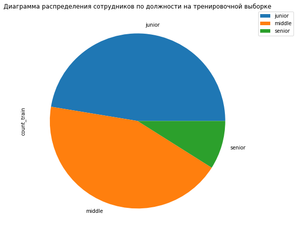
    


    
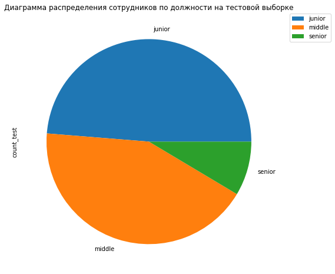
    


<div>
<style scoped>
    .dataframe tbody tr th:only-of-type {
        vertical-align: middle;
    }

    .dataframe tbody tr th {
        vertical-align: top;
    }

    .dataframe thead th {
        text-align: right;
    }
</style>
<table border="1" class="dataframe">
  <thead>
    <tr style="text-align: right;">
      <th></th>
      <th>percentage_train</th>
      <th>percentage_test</th>
    </tr>
    <tr>
      <th>level</th>
      <th></th>
      <th></th>
    </tr>
  </thead>
  <tbody>
    <tr>
      <th>junior</th>
      <td>0.4735</td>
      <td>0.4870</td>
    </tr>
    <tr>
      <th>middle</th>
      <td>0.4360</td>
      <td>0.4270</td>
    </tr>
    <tr>
      <th>senior</th>
      <td>0.0895</td>
      <td>0.0855</td>
    </tr>
  </tbody>
</table>
</div>


```python
show_train_test_pie(sat_df, test_df, 'workload', 'salary', 'Диаграмма распределения сотрудников по загруженности')
```


    
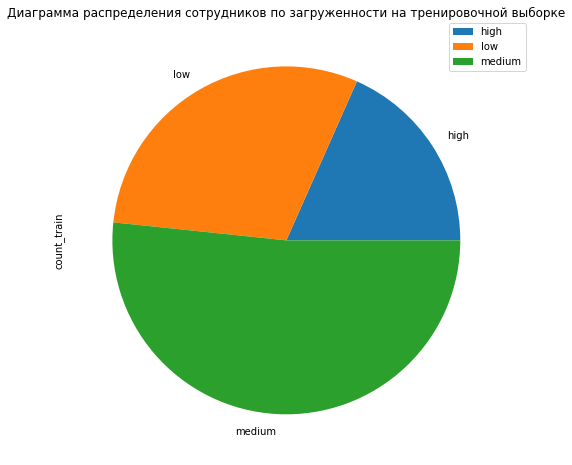
    


    
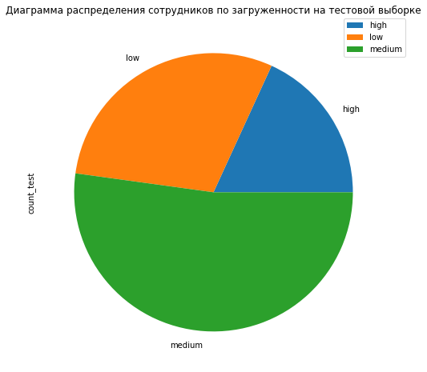
    


<div>
<style scoped>
    .dataframe tbody tr th:only-of-type {
        vertical-align: middle;
    }

    .dataframe tbody tr th {
        vertical-align: top;
    }

    .dataframe thead th {
        text-align: right;
    }
</style>
<table border="1" class="dataframe">
  <thead>
    <tr style="text-align: right;">
      <th></th>
      <th>percentage_train</th>
      <th>percentage_test</th>
    </tr>
    <tr>
      <th>workload</th>
      <th></th>
      <th></th>
    </tr>
  </thead>
  <tbody>
    <tr>
      <th>high</th>
      <td>0.1835</td>
      <td>0.1815</td>
    </tr>
    <tr>
      <th>low</th>
      <td>0.3000</td>
      <td>0.2965</td>
    </tr>
    <tr>
      <th>medium</th>
      <td>0.5165</td>
      <td>0.5215</td>
    </tr>
  </tbody>
</table>
</div>


```python
show_train_test_pie(sat_df, test_df, 'last_year_promo', 'salary', 'Диаграмма распределения сотрудников по наличию повышения в последний год')
```


    
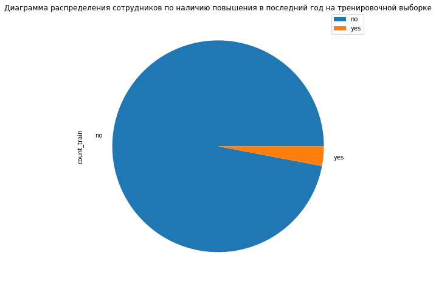
    


    
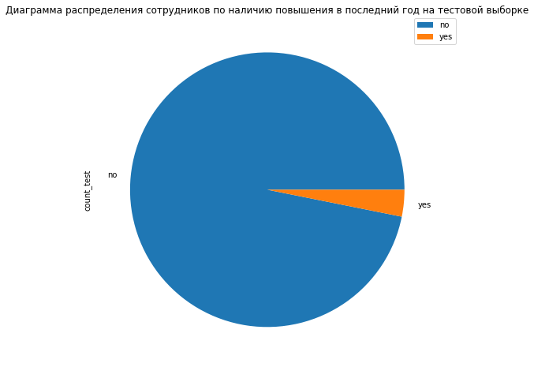
    


<div>
<style scoped>
    .dataframe tbody tr th:only-of-type {
        vertical-align: middle;
    }

    .dataframe tbody tr th {
        vertical-align: top;
    }

    .dataframe thead th {
        text-align: right;
    }
</style>
<table border="1" class="dataframe">
  <thead>
    <tr style="text-align: right;">
      <th></th>
      <th>percentage_train</th>
      <th>percentage_test</th>
    </tr>
    <tr>
      <th>last_year_promo</th>
      <th></th>
      <th></th>
    </tr>
  </thead>
  <tbody>
    <tr>
      <th>no</th>
      <td>0.97</td>
      <td>0.9685</td>
    </tr>
    <tr>
      <th>yes</th>
      <td>0.03</td>
      <td>0.0315</td>
    </tr>
  </tbody>
</table>
</div>


```python
show_train_test_pie(sat_df, test_df, 'last_year_violations', 'salary', 'Диаграмма распределения сотрудников по наличию нарушений в последний год')
```


    
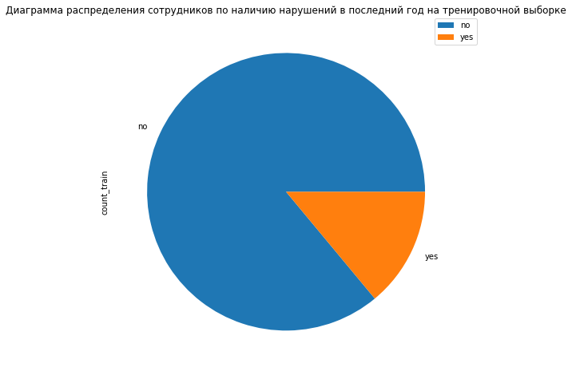
    


    
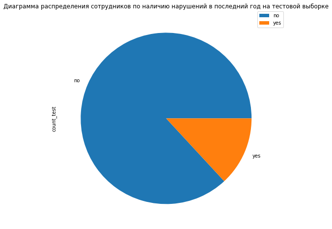
    


<div>
<style scoped>
    .dataframe tbody tr th:only-of-type {
        vertical-align: middle;
    }

    .dataframe tbody tr th {
        vertical-align: top;
    }

    .dataframe thead th {
        text-align: right;
    }
</style>
<table border="1" class="dataframe">
  <thead>
    <tr style="text-align: right;">
      <th></th>
      <th>percentage_train</th>
      <th>percentage_test</th>
    </tr>
    <tr>
      <th>last_year_violations</th>
      <th></th>
      <th></th>
    </tr>
  </thead>
  <tbody>
    <tr>
      <th>no</th>
      <td>0.86025</td>
      <td>0.869</td>
    </tr>
    <tr>
      <th>yes</th>
      <td>0.13975</td>
      <td>0.131</td>
    </tr>
  </tbody>
</table>
</div>


Виден значительный дисбаланс в следующих признаках:

* level - сотрудников уровня *senior* в 3 раза меньше, чем сотрудников уровня *middle* или *junior*

* last_year_promo - лишь 3% сторудников получало повышение в последний год

* last_year_violations - перевес в 6 раз в пользу ненарушавших трудовой договор 

Значительных различий между тренировочной и тестовой выборкой на категориальных признаках нет

 ### Количественные признаки

##### Статистический анализ


```python
display(sat_df.describe())
display(test_df.describe())
```


<div>
<style scoped>
    .dataframe tbody tr th:only-of-type {
        vertical-align: middle;
    }

    .dataframe tbody tr th {
        vertical-align: top;
    }

    .dataframe thead th {
        text-align: right;
    }
</style>
<table border="1" class="dataframe">
  <thead>
    <tr style="text-align: right;">
      <th></th>
      <th>employment_years</th>
      <th>supervisor_evaluation</th>
      <th>salary</th>
      <th>job_satisfaction_rate</th>
    </tr>
  </thead>
  <tbody>
    <tr>
      <th>count</th>
      <td>4000.000000</td>
      <td>4000.000000</td>
      <td>4000.000000</td>
      <td>4000.000000</td>
    </tr>
    <tr>
      <th>mean</th>
      <td>3.718500</td>
      <td>3.476500</td>
      <td>33926.700000</td>
      <td>0.533995</td>
    </tr>
    <tr>
      <th>std</th>
      <td>2.542513</td>
      <td>1.008812</td>
      <td>14900.703838</td>
      <td>0.225327</td>
    </tr>
    <tr>
      <th>min</th>
      <td>1.000000</td>
      <td>1.000000</td>
      <td>12000.000000</td>
      <td>0.030000</td>
    </tr>
    <tr>
      <th>25%</th>
      <td>2.000000</td>
      <td>3.000000</td>
      <td>22800.000000</td>
      <td>0.360000</td>
    </tr>
    <tr>
      <th>50%</th>
      <td>3.000000</td>
      <td>4.000000</td>
      <td>30000.000000</td>
      <td>0.560000</td>
    </tr>
    <tr>
      <th>75%</th>
      <td>6.000000</td>
      <td>4.000000</td>
      <td>43200.000000</td>
      <td>0.710000</td>
    </tr>
    <tr>
      <th>max</th>
      <td>10.000000</td>
      <td>5.000000</td>
      <td>98400.000000</td>
      <td>1.000000</td>
    </tr>
  </tbody>
</table>
</div>


<div>
<style scoped>
    .dataframe tbody tr th:only-of-type {
        vertical-align: middle;
    }

    .dataframe tbody tr th {
        vertical-align: top;
    }

    .dataframe thead th {
        text-align: right;
    }
</style>
<table border="1" class="dataframe">
  <thead>
    <tr style="text-align: right;">
      <th></th>
      <th>employment_years</th>
      <th>supervisor_evaluation</th>
      <th>salary</th>
      <th>job_satisfaction_rate</th>
    </tr>
  </thead>
  <tbody>
    <tr>
      <th>count</th>
      <td>2000.000000</td>
      <td>2000.000000</td>
      <td>2000.000000</td>
      <td>2000.00000</td>
    </tr>
    <tr>
      <th>mean</th>
      <td>3.666500</td>
      <td>3.526500</td>
      <td>34066.800000</td>
      <td>0.54878</td>
    </tr>
    <tr>
      <th>std</th>
      <td>2.537222</td>
      <td>0.996892</td>
      <td>15398.436729</td>
      <td>0.22011</td>
    </tr>
    <tr>
      <th>min</th>
      <td>1.000000</td>
      <td>1.000000</td>
      <td>12000.000000</td>
      <td>0.03000</td>
    </tr>
    <tr>
      <th>25%</th>
      <td>1.000000</td>
      <td>3.000000</td>
      <td>22800.000000</td>
      <td>0.38000</td>
    </tr>
    <tr>
      <th>50%</th>
      <td>3.000000</td>
      <td>4.000000</td>
      <td>30000.000000</td>
      <td>0.58000</td>
    </tr>
    <tr>
      <th>75%</th>
      <td>6.000000</td>
      <td>4.000000</td>
      <td>43200.000000</td>
      <td>0.72000</td>
    </tr>
    <tr>
      <th>max</th>
      <td>10.000000</td>
      <td>5.000000</td>
      <td>96000.000000</td>
      <td>1.00000</td>
    </tr>
  </tbody>
</table>
</div>


Явных выбросов не видно

##### Графический анализ


```python
def show_hist_boxplot(df,sign, bins, title1, title2 = None): 
    
    plt.subplot(1, 2, 1)
    df[sign].plot(kind = 'hist', bins = bins, alpha = 0.7, title = title1)
    
    plt.axvline(x=np.nanmedian (df[sign]), color='red', linestyle='--', linewidth= 3 , label='медиана = ' + str(df[sign].median())) 
    plt.axvline(x=np.nanmean (df[sign]), color='green', linestyle='--', linewidth= 3 , label='среднее = ' + str(round(df[sign].mean(), 2))) 
    plt.legend()
    if title2 == None:
        return
    plt.subplot(1, 2, 2)
    df.boxplot(sign)
    plt.title(title2)
    plt.show()  

def show_train_test_barplot(df1, df2, col, val, tit):
    temp1 = pd.pivot_table(df1, index = col, values = val, aggfunc = 'count')
    temp1.columns = ['count_train']
    temp1['percentage_train'] = temp1['count_train']/len(df1)
    temp1.plot(kind = 'bar', y = 'count_train', title = tit + " на тренировочной выборке")
    plt.legend(loc='best')
    plt.ylabel('count')
    
    temp2 = pd.pivot_table(df2, index = col, values = val, aggfunc = 'count')
    temp2.columns = ['count_test']
    temp2['percentage_test'] = temp2['count_test']/len(df2)
    temp2.plot(kind = 'bar', y = 'count_test', title = tit + " на тестовой выборке")
    plt.legend(loc='best')
    plt.ylabel('count')
    
    display(temp1.join(temp2)[['percentage_train', 'percentage_test']])
    plt.show()
sat_df.info()
```

    <class 'pandas.core.frame.DataFrame'>
    Int64Index: 4000 entries, 155278 to 338347
    Data columns (total 9 columns):
     #   Column                 Non-Null Count  Dtype  
    ---  ------                 --------------  -----  
     0   dept                   3994 non-null   object 
     1   level                  3996 non-null   object 
     2   workload               4000 non-null   object 
     3   employment_years       4000 non-null   int64  
     4   last_year_promo        4000 non-null   object 
     5   last_year_violations   4000 non-null   object 
     6   supervisor_evaluation  4000 non-null   int64  
     7   salary                 4000 non-null   int64  
     8   job_satisfaction_rate  4000 non-null   float64
    dtypes: float64(1), int64(3), object(5)
    memory usage: 312.5+ KB


```python
show_train_test_barplot(sat_df, test_df, 'employment_years', 'level', 'График распределения сотрудников по стажу работы')
```


<div>
<style scoped>
    .dataframe tbody tr th:only-of-type {
        vertical-align: middle;
    }

    .dataframe tbody tr th {
        vertical-align: top;
    }

    .dataframe thead th {
        text-align: right;
    }
</style>
<table border="1" class="dataframe">
  <thead>
    <tr style="text-align: right;">
      <th></th>
      <th>percentage_train</th>
      <th>percentage_test</th>
    </tr>
    <tr>
      <th>employment_years</th>
      <th></th>
      <th></th>
    </tr>
  </thead>
  <tbody>
    <tr>
      <th>1</th>
      <td>0.24050</td>
      <td>0.2605</td>
    </tr>
    <tr>
      <th>2</th>
      <td>0.19625</td>
      <td>0.1870</td>
    </tr>
    <tr>
      <th>3</th>
      <td>0.12075</td>
      <td>0.1170</td>
    </tr>
    <tr>
      <th>4</th>
      <td>0.09600</td>
      <td>0.0935</td>
    </tr>
    <tr>
      <th>5</th>
      <td>0.09500</td>
      <td>0.0895</td>
    </tr>
    <tr>
      <th>6</th>
      <td>0.07175</td>
      <td>0.0690</td>
    </tr>
    <tr>
      <th>7</th>
      <td>0.07525</td>
      <td>0.0870</td>
    </tr>
    <tr>
      <th>8</th>
      <td>0.04825</td>
      <td>0.0455</td>
    </tr>
    <tr>
      <th>9</th>
      <td>0.03250</td>
      <td>0.0330</td>
    </tr>
    <tr>
      <th>10</th>
      <td>0.02275</td>
      <td>0.0175</td>
    </tr>
  </tbody>
</table>
</div>


    
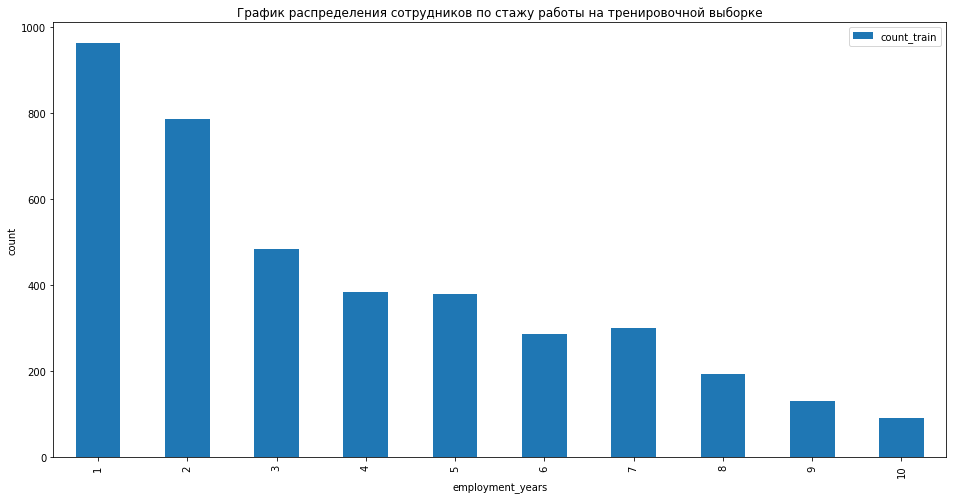
    


    
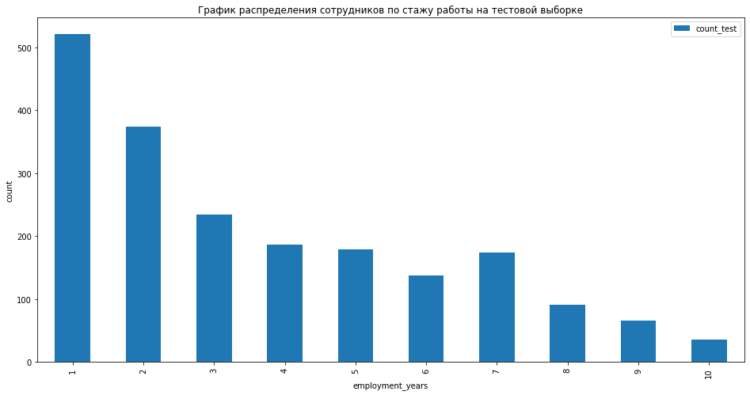
    


```python
show_train_test_barplot(sat_df, test_df, 'supervisor_evaluation', 'level', 'График распределения сотрудников по оценке качества работы')
```


<div>
<style scoped>
    .dataframe tbody tr th:only-of-type {
        vertical-align: middle;
    }

    .dataframe tbody tr th {
        vertical-align: top;
    }

    .dataframe thead th {
        text-align: right;
    }
</style>
<table border="1" class="dataframe">
  <thead>
    <tr style="text-align: right;">
      <th></th>
      <th>percentage_train</th>
      <th>percentage_test</th>
    </tr>
    <tr>
      <th>supervisor_evaluation</th>
      <th></th>
      <th></th>
    </tr>
  </thead>
  <tbody>
    <tr>
      <th>1</th>
      <td>0.05025</td>
      <td>0.0440</td>
    </tr>
    <tr>
      <th>2</th>
      <td>0.09675</td>
      <td>0.0980</td>
    </tr>
    <tr>
      <th>3</th>
      <td>0.31550</td>
      <td>0.2870</td>
    </tr>
    <tr>
      <th>4</th>
      <td>0.40050</td>
      <td>0.4285</td>
    </tr>
    <tr>
      <th>5</th>
      <td>0.13600</td>
      <td>0.1420</td>
    </tr>
  </tbody>
</table>
</div>


    
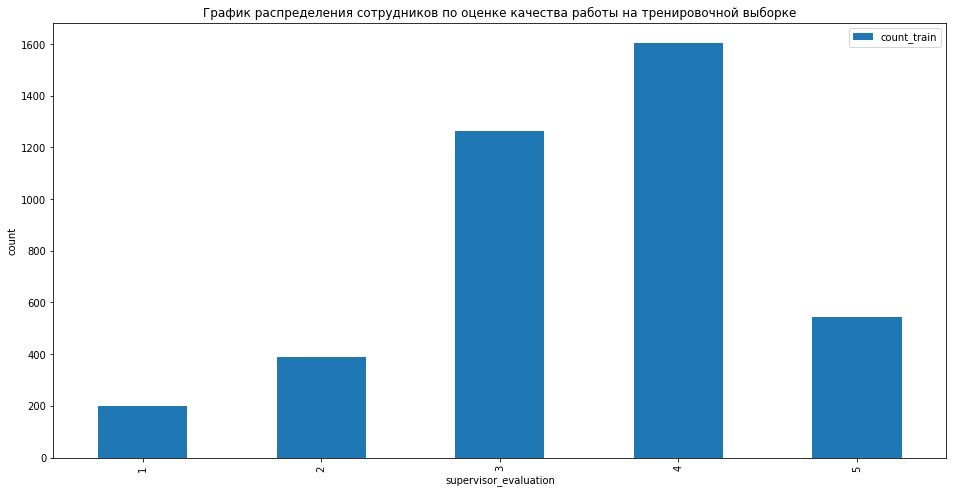
    


    
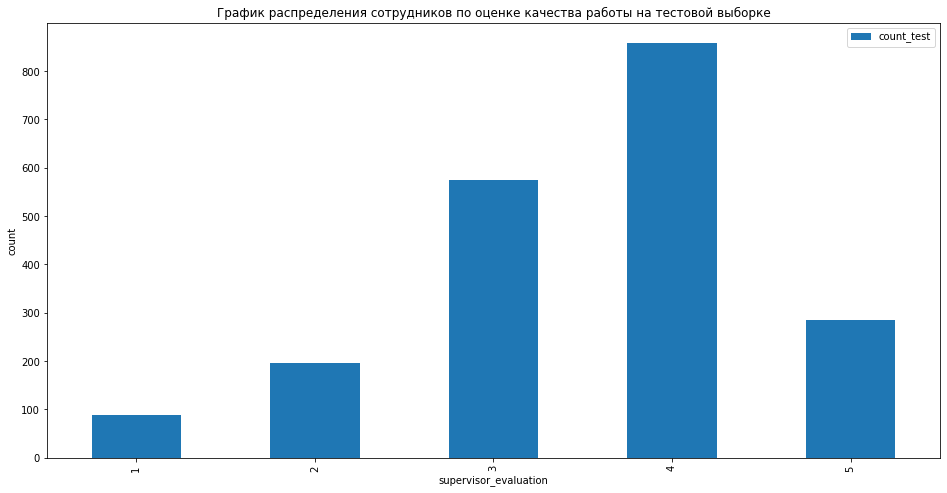
    


```python
show_hist_boxplot(sat_df, 'salary', 20, 'Гистограмма распределения сотрудников по зарплатам (трен.выборка)', 'Диаграмма размаха сотрудников по зарплатам (трен.выборка)')
show_hist_boxplot(test_df, 'salary', 20, 'Гистограмма распределения сотрудников по зарплатам (тест.выборка)', 'Диаграмма размаха сотрудников по зарплатам (тест.выборка)')
```


    
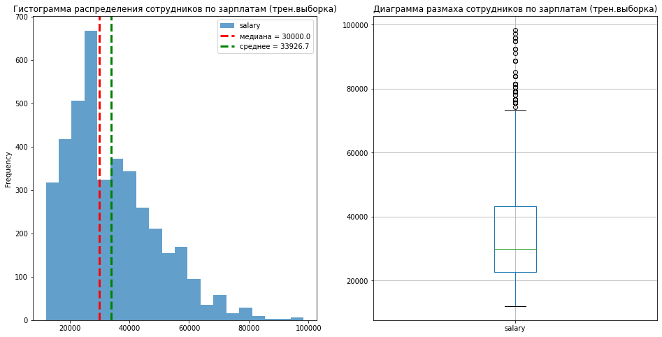
    


    
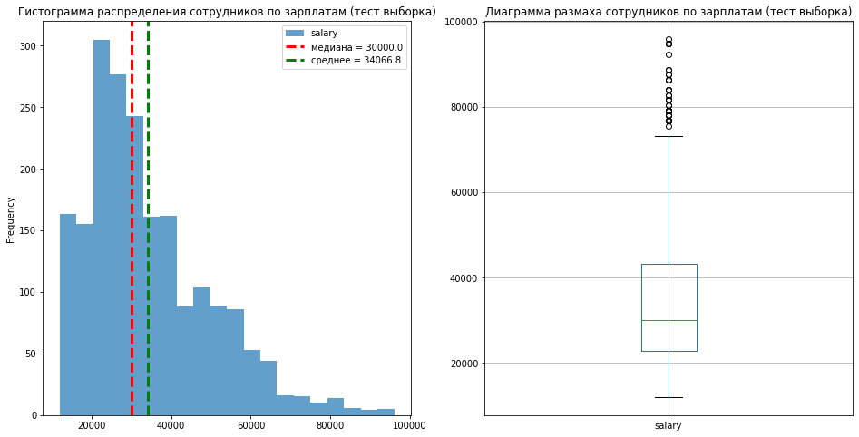
    


```python
show_hist_boxplot(sat_df, 'job_satisfaction_rate', 20, 'Гистограмма распределения по уровню удволетворенности (трен.выборка)', 'Диаграмма размаха по уровню удволетворенности (трен.выборка)')
show_hist_boxplot(test_df, 'job_satisfaction_rate', 20, 'Гистограмма распределения по уровню удволетворенности (тест.выборка)', 'Диаграмма размаха по уровню удволетворенности (тест.выборка)')
```


    
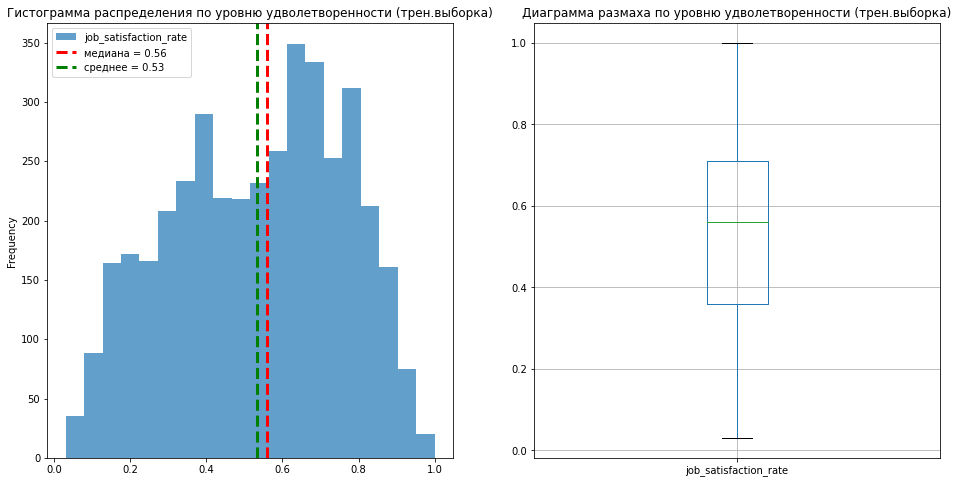
    


    
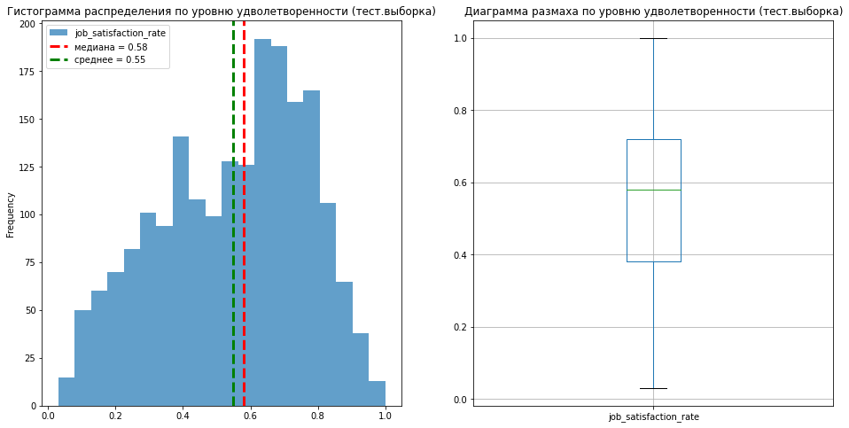
    


Выводы из анализа:

* Количество людей по стажу работы планомерно снижается

* Оценка качества работы нормальная - большинство оценок - 3 и 4

* Зарплаты распределены близко к Пуассоновскому распределению (из-за хвоста справа)

* Удволетворенность работой распределена близко к нормальному (за исключением небольших пиков около 0.4 и 0.7)

Сильных различий между тренировочной и тестовой выборкой также не наблюдается

### Корреляционный анализ

Построим матрицу корреляции используя коэффициент корреляции $\phi_k$


```python
phik_coef_train = sat_df.phik_matrix(interval_cols = ['job_satisfaction_rate', 'salary'])
phik_coef_test= test_df.phik_matrix(interval_cols = ['job_satisfaction_rate', 'salary'])
```


```python
plot_correlation_matrix(
    phik_coef_train.values,
    x_labels = phik_coef_train.columns,
    y_labels = phik_coef_train.index,
    title = 'Матрица корреляции $\phi_k$ на тренировочной выборке',
    figsize=(15, 12),
    fontsize_factor=1.5
)

plot_correlation_matrix(
    phik_coef_test.values,
    x_labels = phik_coef_test.columns,
    y_labels = phik_coef_test.index,
    title = 'Матрица корреляции $\phi_k$ на тестовой выборке',
    figsize=(15, 12),
    fontsize_factor=1.5
)
```


    
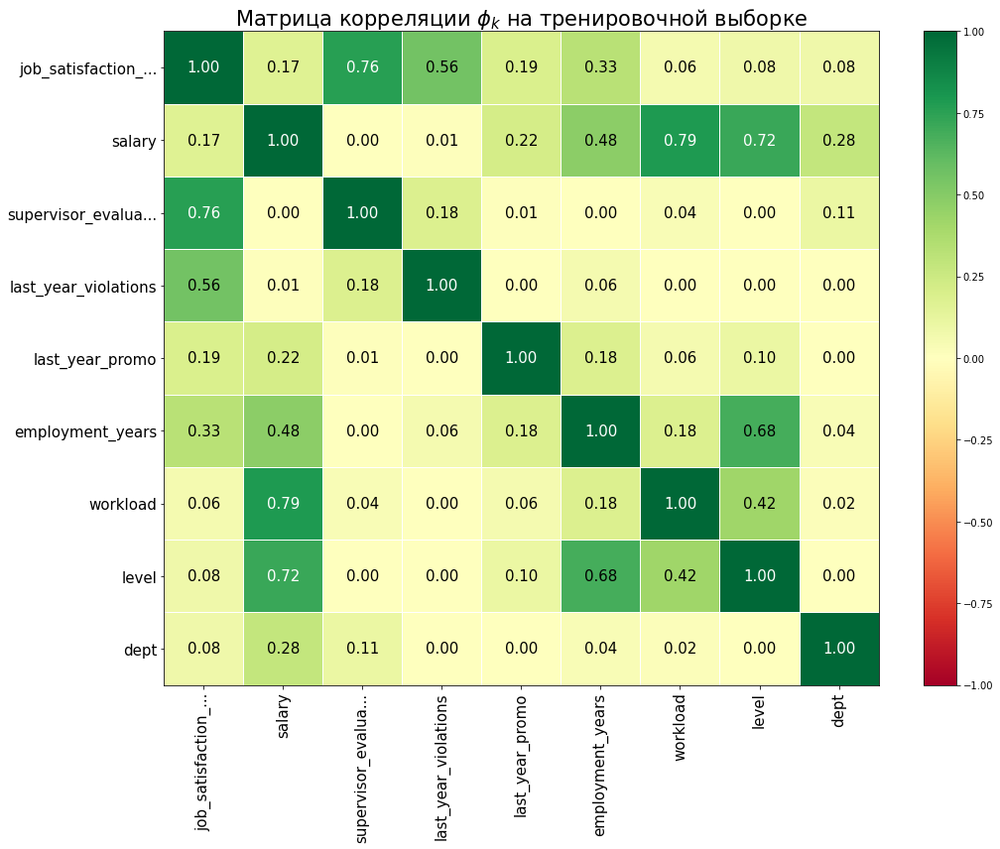
    


    
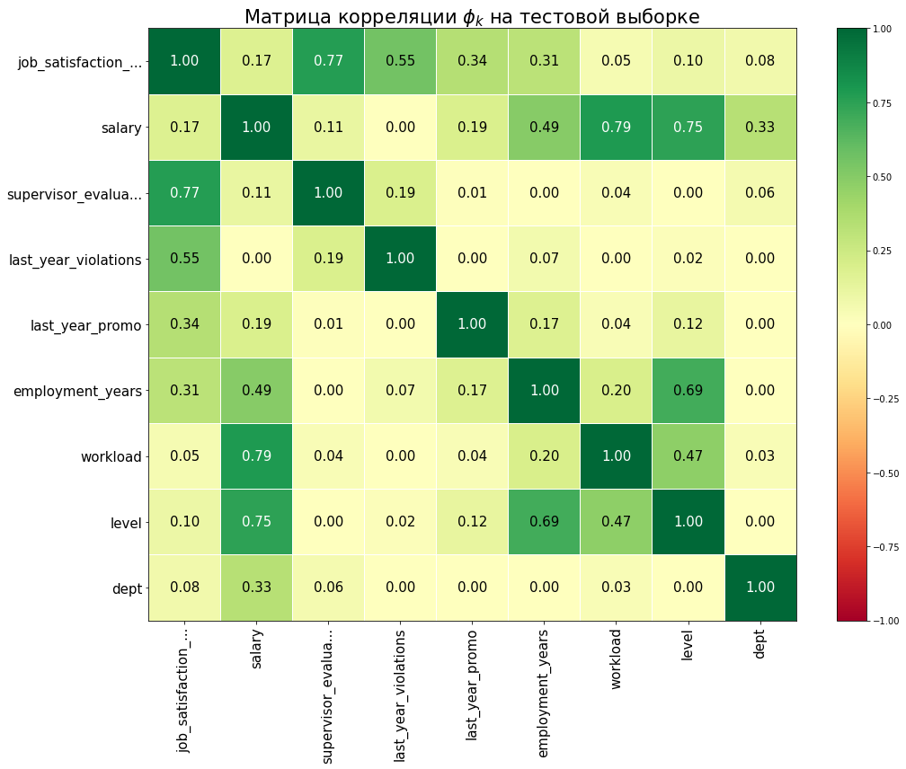
    


Можно увидеть как и достаточно ожидаемые связи: то, что зарплата довольно сильно связана с уровнем сотрудника и его загруженностью (коэффициенты 0.72 и 0.78 соответственно), а также то, что уровень сотрудника достаточно сильно связан с опытом работы (коэффициент корреляции 0.68), так и не самые очевидные - например то, что удволетворенность сотрудника работой и оценка качества работы сотрудника компанией также достаточно сильно коррелируют (коэффициент корреляции 0.76). 

Заметных различий в корреляции признаков на тренировочной и тестовой выборке не обнаружено

Однако надо помнить, что $\phi_k$ замечает не только линейные зависимости. Построим несколько диаграмм рассеяния между заметно коррелирующими признаками и посмотрим на типы зависимостей (только на тренировочной выборке)


```python
def show_scatter_corr(df, x, y, title, sign = None):
    if sign == None:
        plt.scatter(x = df[x], y = df[y])
    else:
        sign_list = df[sign].unique()
        colors = ['blue', 'red', 'green', 'pink', 'yellow', 'black']
        col_dict = {}
        for i in range(len(sign_list)):
            col_dict[sign_list[i]] = colors[i]
        scatter = plt.scatter(x = df[x], y = df[y], c = df[sign].map(col_dict))
    plt.title(title)
    plt.xlabel(x)
    plt.ylabel(y)
    plt.show()
```


```python
show_scatter_corr(sat_df, 'salary', 'job_satisfaction_rate', 'Диаграмма рассеяния уровня удволетворенности сотрудника работой от зарплаты с учётом уровня', 'level')
```


    
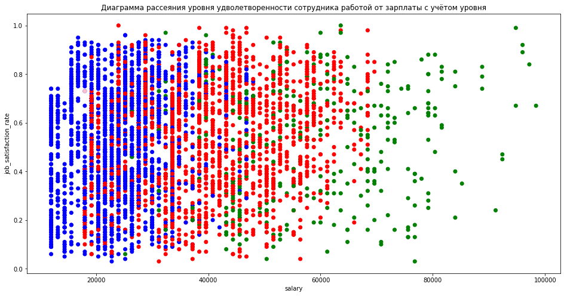
    


```python
show_scatter_corr(sat_df, 'employment_years', 'salary', 'Диаграмма рассеяния зарплаты сотрудника работой от стажа с учётом отдела', 'dept')
```


    
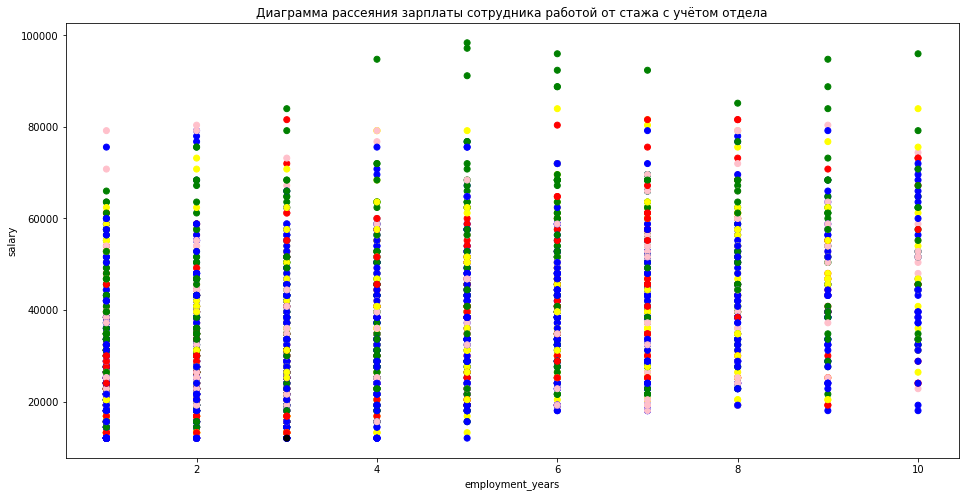
    


```python
show_scatter_corr(sat_df, 'salary', 'job_satisfaction_rate', 'Диаграмма рассеяния уровня удволетворенности сотрудника работой от зарплаты с учётом уровня загруженности', 'workload')
```


    
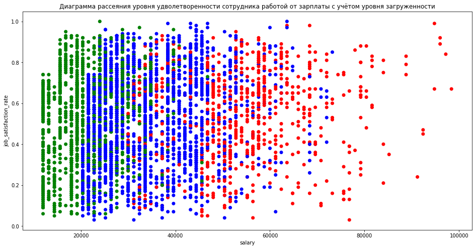
    


```python
show_scatter_corr(sat_df, 'employment_years', 'job_satisfaction_rate', 'Диаграмма рассеяния уровня удволетворенности сотрудника работой от зарплаты с учётом уровня', 'workload')
```


    
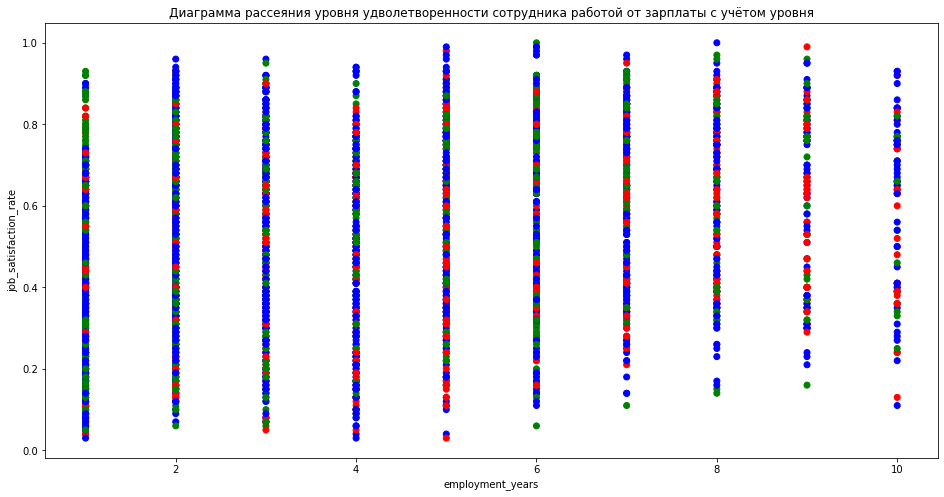
    


```python
show_scatter_corr(sat_df, 'supervisor_evaluation', 'job_satisfaction_rate', 'Диаграмма рассеяния уровня удволетворенности сотрудника работой от оценки качества работы с учётом уровня', 'level')
```


    
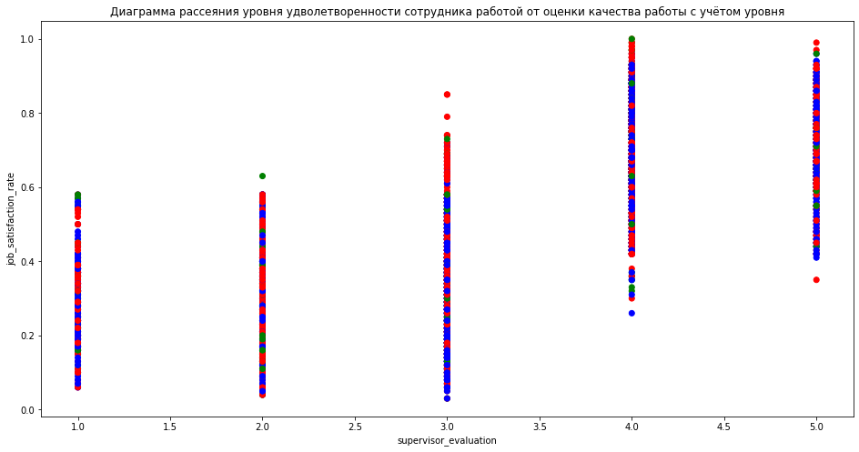
    


Во всех представленных графиках никакой чёткой зависимости между количественными признаками не наблюдается, лишь в зависимости уровня удволетворенности сотрудника работой от оценки качества работы сотрудника руководителем виднеется некая закономерность: в среднем чем выше оценка работы, тем выше уровень удволетворённости. Но всё же зависимость не сильная.

Что касается категориальных признаков, то подтвердилось вышеуказанное: зарплата сильно коррелирует с уровнем сотрудника (первый график) и его загуженностью (третий график)

## Подготовка данных

Категориальные признаки кодируем следующим образом:

* *dept*, *last_year_violation*, *last_year_promo* - через OneHot Encoder, т.к. у признака *dept* более 2 значений, которые нельзя проранжировать от большего к меньшему (у *last_year_violation* и *last_year_promo* всего по 2 уникальных значения, так что без разницы, как их кодировать)

* *level*, *workload*  - через OrdinalEncoder, т.к. их значения ранжируются от меньшего к большему

Количественные признаки будем масштабировать через Standardscaler, RobustScaler и MinMaxScaler, в дальнейшем выберем лучший вариант


```python
ord_col = ['level', 'workload']
ord_cats = [['junior', 'middle', 'senior'], ['low', 'medium', 'high']]
ohe_col = ['dept', 'last_year_violations', 'last_year_promo']
num_col = sat_df.select_dtypes(['int', 'float']).drop(['job_satisfaction_rate'], axis = 1).columns.tolist()

ohe_pipe = Pipeline(
    [
        (
            'simpleImputer_ohe',
            SimpleImputer(missing_values=np.nan, strategy = 'most_frequent')
        ),
        
        (
            'ohe', OneHotEncoder(drop = 'first', handle_unknown = 'ignore',
                                sparse_output = False)
        )
    ]
)

ord_pipe = Pipeline(
    [
        (
            'simpleImputer_before_ord', 
            SimpleImputer(missing_values=np.nan, strategy='most_frequent')
        ),
        
        (
            'ord', OrdinalEncoder(handle_unknown = 'use_encoded_value',\
                               unknown_value=np.nan, categories = ord_cats)
        ),
        
        (
         'simpleImputer_after_ord', 
            SimpleImputer(missing_values=np.nan, strategy='most_frequent')
        )
    ]
)

preprocessor_pipe = ColumnTransformer(
    [
    ('ohe', ohe_pipe, ohe_col),
    ('ord', ord_pipe, ord_col),
    ('num', RobustScaler(), num_col) # выберем масштабирование позднее
    ],
    remainder = 'passthrough'
)

pipe_final = Pipeline(
    [
        ('preprocessor', preprocessor_pipe),
        ('model', None)#выберем модель позднее
    ]
)
```

## Обучение моделей

Для прогнозирования целевого признака обучим 3 модели: DecisionTreeRegressor, LinearRegression и Lasso. Оценивать качество модели будем при помощи кастомной метрики:

$$SMAPE = \frac{100}{n}\sum\limits_{i = 1}^n \frac{|y_i - \overline{y_i}|}{(|y_i| + |\overline{y_i}|)/2}$$


```python
def smape(y_true, y_pred):
    y_true = np.asarray(y_true)
    y_pred = np.asarray(y_pred)
    return 100 * np.mean(np.abs(y_true - y_pred) / ((np.abs(y_true) + np.abs(y_pred)) / 2.0))
```


```python
X_train = sat_df.drop(['job_satisfaction_rate'], axis = 1)
```


```python
y_train = sat_df['job_satisfaction_rate']

param_grid = [
    {
        'preprocessor__num': [StandardScaler(), RobustScaler(), MinMaxScaler()],
        'model': [DecisionTreeRegressor(random_state=RANDOM_STATE)],
        'model__max_depth': [10, 20, 25, 30, 35],
        'model__max_features': ['sqrt'],
        'model__min_samples_split': [1, 2, 5, 10],
        'model__min_samples_leaf': [1, 2, 4]
        
    },
    
    {
        'preprocessor__num': [MinMaxScaler(), RobustScaler()],
        'model': [LinearRegression()]
    },
    
    {
        'preprocessor__num': [MinMaxScaler(), RobustScaler()],
        'model': [Lasso()],
        'model__alpha': [0.01, 0.1, 1.0, 10.0, 100.0]
    }
]

smape_scorer = make_scorer(smape, greater_is_better = False)
```


```python
grid_search = GridSearchCV(
    pipe_final,
    param_grid=param_grid, 
    cv = KFold(n_splits=10, shuffle=True, random_state=RANDOM_STATE),
    scoring=smape_scorer,
    n_jobs=-1
)
```


```python
grid_search.fit(X_train, y_train)

X_test = test_df.drop(['job_satisfaction_rate'], axis = 1)
y_test = test_df['job_satisfaction_rate']

y_pred = grid_search.predict(X_test)

y_train_pred = grid_search.predict(X_train)

print('Лучшая модель и её параметры:\n\n', grid_search.best_estimator_)
print('Метрика smape лучшей модели при кросс-валидации на тренировочной выборке', abs(round(grid_search.best_score_, 2)))
```

    Лучшая модель и её параметры:
    
     Pipeline(steps=[('preprocessor',
                     ColumnTransformer(remainder='passthrough',
                                       transformers=[('ohe',
                                                      Pipeline(steps=[('simpleImputer_ohe',
                                                                       SimpleImputer(strategy='most_frequent')),
                                                                      ('ohe',
                                                                       OneHotEncoder(drop='first',
                                                                                     handle_unknown='ignore',
                                                                                     sparse_output=False))]),
                                                      ['dept',
                                                       'last_year_violations',
                                                       'last_year_promo']),
                                                     ('ord',
                                                      Pipeline(steps=[('simpleImputer_befor...
                                                                                                  ['low',
                                                                                                   'medium',
                                                                                                   'high']],
                                                                                      handle_unknown='use_encoded_value',
                                                                                      unknown_value=nan)),
                                                                      ('simpleImputer_after_ord',
                                                                       SimpleImputer(strategy='most_frequent'))]),
                                                      ['level', 'workload']),
                                                     ('num', RobustScaler(),
                                                      ['employment_years',
                                                       'supervisor_evaluation',
                                                       'salary'])])),
                    ('model',
                     DecisionTreeRegressor(max_depth=20, max_features='sqrt',
                                           min_samples_leaf=2, random_state=42))])
    Метрика smape лучшей модели при кросс-валидации на тренировочной выборке 16.08


```python
print('Метрика smape лучшей модели на тестовой выборке', round(smape(y_test, y_pred), 2))
model = grid_search.best_estimator_
```

    Метрика smape лучшей модели на тестовой выборке 14.96


```python
rate_model = grid_search.best_estimator_
```

Удалось достичь метрики smape на тестовой выборке 14.96: этот результат выдала модель DecisionTreeRegressor с функцией sqrt. Проанализируем значимость признаков

## Анализ значимости признаков


```python
permutation = permutation_importance(model, X_test, y_test, scoring=smape_scorer)
feature_importance = pd.DataFrame({'Feature': X_test.columns, 'Importance': permutation['importances_mean']})
feature_importance = feature_importance.sort_values('Importance', ascending=True)
sns.set_style('white')
feature_importance.plot(x='Feature', y='Importance', kind='barh', figsize=(10, 6), title = 'Важность признаков для модели') 
plt.xlabel('importance')
plt.show()
```


    
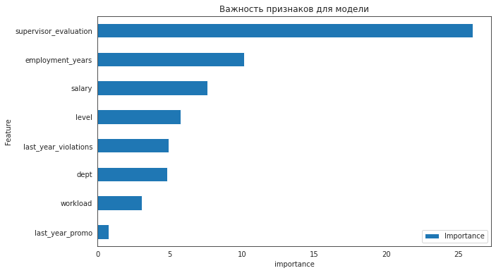
    


Как мы видим, самым важным (с большим отрывом) признаком для определения удволетворённости сотрудника оказался признак *supervisor_evaluation*, т.е. оценка работы сотрудника руководством. Далее идут стаж, зарплата и уровень сотрудника. Осталось посмотреть, в какую именно сторону эти признаки влияют на целевой


```python
X_test_transformed = rate_model.named_steps['preprocessor'].transform(X_test)

explainer = shap.Explainer(rate_model.named_steps['model'].predict,\
                          X_test_transformed,\
                          feature_names = rate_model.named_steps['preprocessor'].get_feature_names_out())

shap_values = explainer(X_test_transformed)
#shap.plots.beeswarm(shap_values, max_display = len(X_test_transformed)) 
shap.summary_plot(shap_values, max_display = len(X_test_transformed), show=False)

ax = plt.gca()

ax.set_title("График Shap-значений признаков", fontdict={"size":15})
ax.set_ylabel("Feature", fontsize=13)

plt.show()
```

    PermutationExplainer explainer: 2001it [00:33, 46.71it/s]                          


    
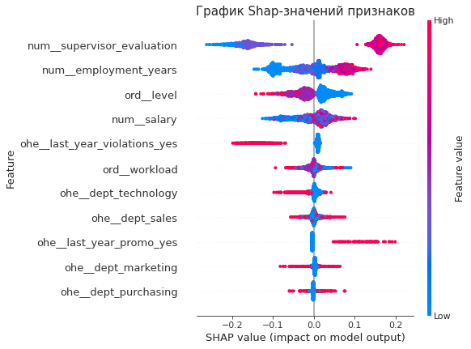
    


Итого, в среднем

* Чем выше оценка сотрудника начальством, тем выше уровень удволетворенности сотрудника

* Чем больше стаж, тем выше уровень удволетворенности сотрудника

* Чем выше уровень, тем ниже уровень удволетворенности сотрудника

* Чем выше зарплата, тем выше уровень удволетворенности сотрудника

## Выводы

Самой эффективной оказалась модель DecisionTreeRegressor с функцией sqrt. Самыми важными признаками оказалась оценка работы сотрудника руководством. Далее идут стаж, зарплата и уровень сотрудника.

# Предсказание увольнения сотрудника из компании

В этой задаче предстоить создать и обучить модель, предсказывающую увольнение сотрудников из компании

## Загрузка данных


```python
quit_df = pd.read_csv('/datasets/train_quit.csv')# тренировочные данные
# входные признаки тестовой выборки те же, что и до этого, и предобработка уже выполнена
test_quit_df = pd.read_csv('/datasets/test_target_quit.csv')# целевые признаки тестовой выборки
display(quit_df.head())
display(test_features_df.head())
display(test_quit_df.head())
```


<div>
<style scoped>
    .dataframe tbody tr th:only-of-type {
        vertical-align: middle;
    }

    .dataframe tbody tr th {
        vertical-align: top;
    }

    .dataframe thead th {
        text-align: right;
    }
</style>
<table border="1" class="dataframe">
  <thead>
    <tr style="text-align: right;">
      <th></th>
      <th>id</th>
      <th>dept</th>
      <th>level</th>
      <th>workload</th>
      <th>employment_years</th>
      <th>last_year_promo</th>
      <th>last_year_violations</th>
      <th>supervisor_evaluation</th>
      <th>salary</th>
      <th>quit</th>
    </tr>
  </thead>
  <tbody>
    <tr>
      <th>0</th>
      <td>723290</td>
      <td>sales</td>
      <td>middle</td>
      <td>high</td>
      <td>2</td>
      <td>no</td>
      <td>no</td>
      <td>4</td>
      <td>54000</td>
      <td>no</td>
    </tr>
    <tr>
      <th>1</th>
      <td>814010</td>
      <td>sales</td>
      <td>junior</td>
      <td>medium</td>
      <td>2</td>
      <td>no</td>
      <td>no</td>
      <td>4</td>
      <td>27600</td>
      <td>no</td>
    </tr>
    <tr>
      <th>2</th>
      <td>155091</td>
      <td>purchasing</td>
      <td>middle</td>
      <td>medium</td>
      <td>5</td>
      <td>no</td>
      <td>no</td>
      <td>1</td>
      <td>37200</td>
      <td>no</td>
    </tr>
    <tr>
      <th>3</th>
      <td>257132</td>
      <td>sales</td>
      <td>junior</td>
      <td>medium</td>
      <td>2</td>
      <td>no</td>
      <td>yes</td>
      <td>3</td>
      <td>24000</td>
      <td>yes</td>
    </tr>
    <tr>
      <th>4</th>
      <td>910140</td>
      <td>marketing</td>
      <td>junior</td>
      <td>medium</td>
      <td>2</td>
      <td>no</td>
      <td>no</td>
      <td>5</td>
      <td>25200</td>
      <td>no</td>
    </tr>
  </tbody>
</table>
</div>


<div>
<style scoped>
    .dataframe tbody tr th:only-of-type {
        vertical-align: middle;
    }

    .dataframe tbody tr th {
        vertical-align: top;
    }

    .dataframe thead th {
        text-align: right;
    }
</style>
<table border="1" class="dataframe">
  <thead>
    <tr style="text-align: right;">
      <th></th>
      <th>dept</th>
      <th>level</th>
      <th>workload</th>
      <th>employment_years</th>
      <th>last_year_promo</th>
      <th>last_year_violations</th>
      <th>supervisor_evaluation</th>
      <th>salary</th>
    </tr>
    <tr>
      <th>id</th>
      <th></th>
      <th></th>
      <th></th>
      <th></th>
      <th></th>
      <th></th>
      <th></th>
      <th></th>
    </tr>
  </thead>
  <tbody>
    <tr>
      <th>485046</th>
      <td>marketing</td>
      <td>junior</td>
      <td>medium</td>
      <td>2</td>
      <td>no</td>
      <td>no</td>
      <td>5</td>
      <td>28800</td>
    </tr>
    <tr>
      <th>686555</th>
      <td>hr</td>
      <td>junior</td>
      <td>medium</td>
      <td>1</td>
      <td>no</td>
      <td>no</td>
      <td>4</td>
      <td>30000</td>
    </tr>
    <tr>
      <th>467458</th>
      <td>sales</td>
      <td>middle</td>
      <td>low</td>
      <td>5</td>
      <td>no</td>
      <td>no</td>
      <td>4</td>
      <td>19200</td>
    </tr>
    <tr>
      <th>418655</th>
      <td>sales</td>
      <td>middle</td>
      <td>low</td>
      <td>6</td>
      <td>no</td>
      <td>no</td>
      <td>4</td>
      <td>19200</td>
    </tr>
    <tr>
      <th>789145</th>
      <td>hr</td>
      <td>middle</td>
      <td>medium</td>
      <td>5</td>
      <td>no</td>
      <td>no</td>
      <td>5</td>
      <td>40800</td>
    </tr>
  </tbody>
</table>
</div>


<div>
<style scoped>
    .dataframe tbody tr th:only-of-type {
        vertical-align: middle;
    }

    .dataframe tbody tr th {
        vertical-align: top;
    }

    .dataframe thead th {
        text-align: right;
    }
</style>
<table border="1" class="dataframe">
  <thead>
    <tr style="text-align: right;">
      <th></th>
      <th>id</th>
      <th>quit</th>
    </tr>
  </thead>
  <tbody>
    <tr>
      <th>0</th>
      <td>999029</td>
      <td>yes</td>
    </tr>
    <tr>
      <th>1</th>
      <td>372846</td>
      <td>no</td>
    </tr>
    <tr>
      <th>2</th>
      <td>726767</td>
      <td>no</td>
    </tr>
    <tr>
      <th>3</th>
      <td>490105</td>
      <td>no</td>
    </tr>
    <tr>
      <th>4</th>
      <td>416898</td>
      <td>yes</td>
    </tr>
  </tbody>
</table>
</div>


## Предобработка данных

### Тренировочная выборка


```python
quit_df.info()
quit_df.head()
```

    <class 'pandas.core.frame.DataFrame'>
    RangeIndex: 4000 entries, 0 to 3999
    Data columns (total 10 columns):
     #   Column                 Non-Null Count  Dtype 
    ---  ------                 --------------  ----- 
     0   id                     4000 non-null   int64 
     1   dept                   4000 non-null   object
     2   level                  4000 non-null   object
     3   workload               4000 non-null   object
     4   employment_years       4000 non-null   int64 
     5   last_year_promo        4000 non-null   object
     6   last_year_violations   4000 non-null   object
     7   supervisor_evaluation  4000 non-null   int64 
     8   salary                 4000 non-null   int64 
     9   quit                   4000 non-null   object
    dtypes: int64(4), object(6)
    memory usage: 312.6+ KB


<div>
<style scoped>
    .dataframe tbody tr th:only-of-type {
        vertical-align: middle;
    }

    .dataframe tbody tr th {
        vertical-align: top;
    }

    .dataframe thead th {
        text-align: right;
    }
</style>
<table border="1" class="dataframe">
  <thead>
    <tr style="text-align: right;">
      <th></th>
      <th>id</th>
      <th>dept</th>
      <th>level</th>
      <th>workload</th>
      <th>employment_years</th>
      <th>last_year_promo</th>
      <th>last_year_violations</th>
      <th>supervisor_evaluation</th>
      <th>salary</th>
      <th>quit</th>
    </tr>
  </thead>
  <tbody>
    <tr>
      <th>0</th>
      <td>723290</td>
      <td>sales</td>
      <td>middle</td>
      <td>high</td>
      <td>2</td>
      <td>no</td>
      <td>no</td>
      <td>4</td>
      <td>54000</td>
      <td>no</td>
    </tr>
    <tr>
      <th>1</th>
      <td>814010</td>
      <td>sales</td>
      <td>junior</td>
      <td>medium</td>
      <td>2</td>
      <td>no</td>
      <td>no</td>
      <td>4</td>
      <td>27600</td>
      <td>no</td>
    </tr>
    <tr>
      <th>2</th>
      <td>155091</td>
      <td>purchasing</td>
      <td>middle</td>
      <td>medium</td>
      <td>5</td>
      <td>no</td>
      <td>no</td>
      <td>1</td>
      <td>37200</td>
      <td>no</td>
    </tr>
    <tr>
      <th>3</th>
      <td>257132</td>
      <td>sales</td>
      <td>junior</td>
      <td>medium</td>
      <td>2</td>
      <td>no</td>
      <td>yes</td>
      <td>3</td>
      <td>24000</td>
      <td>yes</td>
    </tr>
    <tr>
      <th>4</th>
      <td>910140</td>
      <td>marketing</td>
      <td>junior</td>
      <td>medium</td>
      <td>2</td>
      <td>no</td>
      <td>no</td>
      <td>5</td>
      <td>25200</td>
      <td>no</td>
    </tr>
  </tbody>
</table>
</div>


Пропуски отсутствуют

Проверим категориальные столбцы на неявные дубликаты


```python
for col in quit_df.select_dtypes('object').columns.tolist():
    print(col, quit_df[col].unique())

quit_df['level'] = quit_df['level'].replace('sinior', 'senior')
```

    dept ['sales' 'purchasing' 'marketing' 'technology' 'hr']
    level ['middle' 'junior' 'sinior']
    workload ['high' 'medium' 'low']
    last_year_promo ['no' 'yes']
    last_year_violations ['no' 'yes']
    quit ['no' 'yes']


Неявных дубликатов не обнаружено


```python
quit_df = quit_df.drop_duplicates()
quit_df.info()
```

    <class 'pandas.core.frame.DataFrame'>
    Int64Index: 4000 entries, 0 to 3999
    Data columns (total 10 columns):
     #   Column                 Non-Null Count  Dtype 
    ---  ------                 --------------  ----- 
     0   id                     4000 non-null   int64 
     1   dept                   4000 non-null   object
     2   level                  4000 non-null   object
     3   workload               4000 non-null   object
     4   employment_years       4000 non-null   int64 
     5   last_year_promo        4000 non-null   object
     6   last_year_violations   4000 non-null   object
     7   supervisor_evaluation  4000 non-null   int64 
     8   salary                 4000 non-null   int64 
     9   quit                   4000 non-null   object
    dtypes: int64(4), object(6)
    memory usage: 343.8+ KB


Полных дубликатов также не обнаружено

Теперь назначим индексом строки id сотрудника


```python
quit_df = quit_df.set_index('id')
quit_df.head()
```


<div>
<style scoped>
    .dataframe tbody tr th:only-of-type {
        vertical-align: middle;
    }

    .dataframe tbody tr th {
        vertical-align: top;
    }

    .dataframe thead th {
        text-align: right;
    }
</style>
<table border="1" class="dataframe">
  <thead>
    <tr style="text-align: right;">
      <th></th>
      <th>dept</th>
      <th>level</th>
      <th>workload</th>
      <th>employment_years</th>
      <th>last_year_promo</th>
      <th>last_year_violations</th>
      <th>supervisor_evaluation</th>
      <th>salary</th>
      <th>quit</th>
    </tr>
    <tr>
      <th>id</th>
      <th></th>
      <th></th>
      <th></th>
      <th></th>
      <th></th>
      <th></th>
      <th></th>
      <th></th>
      <th></th>
    </tr>
  </thead>
  <tbody>
    <tr>
      <th>723290</th>
      <td>sales</td>
      <td>middle</td>
      <td>high</td>
      <td>2</td>
      <td>no</td>
      <td>no</td>
      <td>4</td>
      <td>54000</td>
      <td>no</td>
    </tr>
    <tr>
      <th>814010</th>
      <td>sales</td>
      <td>junior</td>
      <td>medium</td>
      <td>2</td>
      <td>no</td>
      <td>no</td>
      <td>4</td>
      <td>27600</td>
      <td>no</td>
    </tr>
    <tr>
      <th>155091</th>
      <td>purchasing</td>
      <td>middle</td>
      <td>medium</td>
      <td>5</td>
      <td>no</td>
      <td>no</td>
      <td>1</td>
      <td>37200</td>
      <td>no</td>
    </tr>
    <tr>
      <th>257132</th>
      <td>sales</td>
      <td>junior</td>
      <td>medium</td>
      <td>2</td>
      <td>no</td>
      <td>yes</td>
      <td>3</td>
      <td>24000</td>
      <td>yes</td>
    </tr>
    <tr>
      <th>910140</th>
      <td>marketing</td>
      <td>junior</td>
      <td>medium</td>
      <td>2</td>
      <td>no</td>
      <td>no</td>
      <td>5</td>
      <td>25200</td>
      <td>no</td>
    </tr>
  </tbody>
</table>
</div>


Таблица с признаками уже была предобработана, просто проверим таблицу с целевым признаком на ошибки и объединим таблицы


```python
test_quit_df.info()
```

    <class 'pandas.core.frame.DataFrame'>
    RangeIndex: 2000 entries, 0 to 1999
    Data columns (total 2 columns):
     #   Column  Non-Null Count  Dtype 
    ---  ------  --------------  ----- 
     0   id      2000 non-null   int64 
     1   quit    2000 non-null   object
    dtypes: int64(1), object(1)
    memory usage: 31.4+ KB


Пропусков нет


```python
test_quit_df['quit'].unique()
```


    array(['yes', 'no'], dtype=object)


Неявных дубликатов также нет

Назначим индексом строк id и объединим с таблицей признаков тестовой выборки


```python
test_quit_df = test_quit_df.set_index('id')
test_df2 = test_features_df.join(test_quit_df)
display(test_df2.head())
display(test_quit_df.head())
display(test_features_df.head())
```


<div>
<style scoped>
    .dataframe tbody tr th:only-of-type {
        vertical-align: middle;
    }

    .dataframe tbody tr th {
        vertical-align: top;
    }

    .dataframe thead th {
        text-align: right;
    }
</style>
<table border="1" class="dataframe">
  <thead>
    <tr style="text-align: right;">
      <th></th>
      <th>dept</th>
      <th>level</th>
      <th>workload</th>
      <th>employment_years</th>
      <th>last_year_promo</th>
      <th>last_year_violations</th>
      <th>supervisor_evaluation</th>
      <th>salary</th>
      <th>quit</th>
    </tr>
    <tr>
      <th>id</th>
      <th></th>
      <th></th>
      <th></th>
      <th></th>
      <th></th>
      <th></th>
      <th></th>
      <th></th>
      <th></th>
    </tr>
  </thead>
  <tbody>
    <tr>
      <th>485046</th>
      <td>marketing</td>
      <td>junior</td>
      <td>medium</td>
      <td>2</td>
      <td>no</td>
      <td>no</td>
      <td>5</td>
      <td>28800</td>
      <td>no</td>
    </tr>
    <tr>
      <th>686555</th>
      <td>hr</td>
      <td>junior</td>
      <td>medium</td>
      <td>1</td>
      <td>no</td>
      <td>no</td>
      <td>4</td>
      <td>30000</td>
      <td>no</td>
    </tr>
    <tr>
      <th>467458</th>
      <td>sales</td>
      <td>middle</td>
      <td>low</td>
      <td>5</td>
      <td>no</td>
      <td>no</td>
      <td>4</td>
      <td>19200</td>
      <td>no</td>
    </tr>
    <tr>
      <th>418655</th>
      <td>sales</td>
      <td>middle</td>
      <td>low</td>
      <td>6</td>
      <td>no</td>
      <td>no</td>
      <td>4</td>
      <td>19200</td>
      <td>no</td>
    </tr>
    <tr>
      <th>789145</th>
      <td>hr</td>
      <td>middle</td>
      <td>medium</td>
      <td>5</td>
      <td>no</td>
      <td>no</td>
      <td>5</td>
      <td>40800</td>
      <td>no</td>
    </tr>
  </tbody>
</table>
</div>


<div>
<style scoped>
    .dataframe tbody tr th:only-of-type {
        vertical-align: middle;
    }

    .dataframe tbody tr th {
        vertical-align: top;
    }

    .dataframe thead th {
        text-align: right;
    }
</style>
<table border="1" class="dataframe">
  <thead>
    <tr style="text-align: right;">
      <th></th>
      <th>quit</th>
    </tr>
    <tr>
      <th>id</th>
      <th></th>
    </tr>
  </thead>
  <tbody>
    <tr>
      <th>999029</th>
      <td>yes</td>
    </tr>
    <tr>
      <th>372846</th>
      <td>no</td>
    </tr>
    <tr>
      <th>726767</th>
      <td>no</td>
    </tr>
    <tr>
      <th>490105</th>
      <td>no</td>
    </tr>
    <tr>
      <th>416898</th>
      <td>yes</td>
    </tr>
  </tbody>
</table>
</div>


<div>
<style scoped>
    .dataframe tbody tr th:only-of-type {
        vertical-align: middle;
    }

    .dataframe tbody tr th {
        vertical-align: top;
    }

    .dataframe thead th {
        text-align: right;
    }
</style>
<table border="1" class="dataframe">
  <thead>
    <tr style="text-align: right;">
      <th></th>
      <th>dept</th>
      <th>level</th>
      <th>workload</th>
      <th>employment_years</th>
      <th>last_year_promo</th>
      <th>last_year_violations</th>
      <th>supervisor_evaluation</th>
      <th>salary</th>
    </tr>
    <tr>
      <th>id</th>
      <th></th>
      <th></th>
      <th></th>
      <th></th>
      <th></th>
      <th></th>
      <th></th>
      <th></th>
    </tr>
  </thead>
  <tbody>
    <tr>
      <th>485046</th>
      <td>marketing</td>
      <td>junior</td>
      <td>medium</td>
      <td>2</td>
      <td>no</td>
      <td>no</td>
      <td>5</td>
      <td>28800</td>
    </tr>
    <tr>
      <th>686555</th>
      <td>hr</td>
      <td>junior</td>
      <td>medium</td>
      <td>1</td>
      <td>no</td>
      <td>no</td>
      <td>4</td>
      <td>30000</td>
    </tr>
    <tr>
      <th>467458</th>
      <td>sales</td>
      <td>middle</td>
      <td>low</td>
      <td>5</td>
      <td>no</td>
      <td>no</td>
      <td>4</td>
      <td>19200</td>
    </tr>
    <tr>
      <th>418655</th>
      <td>sales</td>
      <td>middle</td>
      <td>low</td>
      <td>6</td>
      <td>no</td>
      <td>no</td>
      <td>4</td>
      <td>19200</td>
    </tr>
    <tr>
      <th>789145</th>
      <td>hr</td>
      <td>middle</td>
      <td>medium</td>
      <td>5</td>
      <td>no</td>
      <td>no</td>
      <td>5</td>
      <td>40800</td>
    </tr>
  </tbody>
</table>
</div>


```python
display(test_df2.query('quit == "yes"').head())
```


<div>
<style scoped>
    .dataframe tbody tr th:only-of-type {
        vertical-align: middle;
    }

    .dataframe tbody tr th {
        vertical-align: top;
    }

    .dataframe thead th {
        text-align: right;
    }
</style>
<table border="1" class="dataframe">
  <thead>
    <tr style="text-align: right;">
      <th></th>
      <th>dept</th>
      <th>level</th>
      <th>workload</th>
      <th>employment_years</th>
      <th>last_year_promo</th>
      <th>last_year_violations</th>
      <th>supervisor_evaluation</th>
      <th>salary</th>
      <th>quit</th>
    </tr>
    <tr>
      <th>id</th>
      <th></th>
      <th></th>
      <th></th>
      <th></th>
      <th></th>
      <th></th>
      <th></th>
      <th></th>
      <th></th>
    </tr>
  </thead>
  <tbody>
    <tr>
      <th>429973</th>
      <td>purchasing</td>
      <td>middle</td>
      <td>medium</td>
      <td>6</td>
      <td>no</td>
      <td>no</td>
      <td>3</td>
      <td>42000</td>
      <td>yes</td>
    </tr>
    <tr>
      <th>850699</th>
      <td>technology</td>
      <td>junior</td>
      <td>medium</td>
      <td>3</td>
      <td>no</td>
      <td>no</td>
      <td>3</td>
      <td>26400</td>
      <td>yes</td>
    </tr>
    <tr>
      <th>937235</th>
      <td>sales</td>
      <td>junior</td>
      <td>medium</td>
      <td>1</td>
      <td>no</td>
      <td>yes</td>
      <td>3</td>
      <td>26400</td>
      <td>yes</td>
    </tr>
    <tr>
      <th>354261</th>
      <td>technology</td>
      <td>junior</td>
      <td>low</td>
      <td>3</td>
      <td>no</td>
      <td>no</td>
      <td>3</td>
      <td>14400</td>
      <td>yes</td>
    </tr>
    <tr>
      <th>780847</th>
      <td>sales</td>
      <td>junior</td>
      <td>low</td>
      <td>1</td>
      <td>no</td>
      <td>no</td>
      <td>2</td>
      <td>14400</td>
      <td>yes</td>
    </tr>
  </tbody>
</table>
</div>


## Исследовательский анализ

### Категориальные признаки


```python
show_train_test_pie(quit_df, test_df2, 'dept', 'salary', 'Диаграмма распределения сотрудников по отделу')
```


    

    


    

    


<div>
<style scoped>
    .dataframe tbody tr th:only-of-type {
        vertical-align: middle;
    }

    .dataframe tbody tr th {
        vertical-align: top;
    }

    .dataframe thead th {
        text-align: right;
    }
</style>
<table border="1" class="dataframe">
  <thead>
    <tr style="text-align: right;">
      <th></th>
      <th>percentage_train</th>
      <th>percentage_test</th>
    </tr>
    <tr>
      <th>dept</th>
      <th></th>
      <th></th>
    </tr>
  </thead>
  <tbody>
    <tr>
      <th>hr</th>
      <td>0.1160</td>
      <td>0.1135</td>
    </tr>
    <tr>
      <th>marketing</th>
      <td>0.1455</td>
      <td>0.1395</td>
    </tr>
    <tr>
      <th>purchasing</th>
      <td>0.1470</td>
      <td>0.1365</td>
    </tr>
    <tr>
      <th>sales</th>
      <td>0.3595</td>
      <td>0.3815</td>
    </tr>
    <tr>
      <th>technology</th>
      <td>0.2320</td>
      <td>0.2275</td>
    </tr>
  </tbody>
</table>
</div>


```python
show_train_test_pie(quit_df, test_df2, 'level', 'salary', 'Диаграмма распределения сотрудников по должности')
```


    
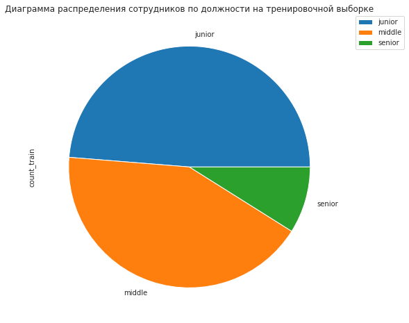
    


    
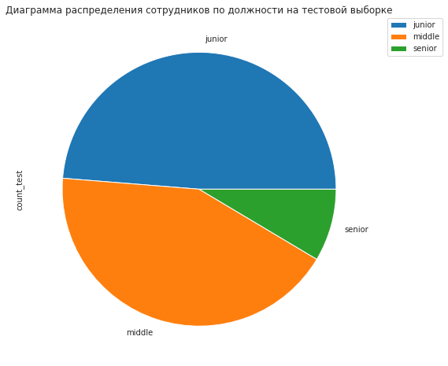
    


<div>
<style scoped>
    .dataframe tbody tr th:only-of-type {
        vertical-align: middle;
    }

    .dataframe tbody tr th {
        vertical-align: top;
    }

    .dataframe thead th {
        text-align: right;
    }
</style>
<table border="1" class="dataframe">
  <thead>
    <tr style="text-align: right;">
      <th></th>
      <th>percentage_train</th>
      <th>percentage_test</th>
    </tr>
    <tr>
      <th>level</th>
      <th></th>
      <th></th>
    </tr>
  </thead>
  <tbody>
    <tr>
      <th>junior</th>
      <td>0.48725</td>
      <td>0.4870</td>
    </tr>
    <tr>
      <th>middle</th>
      <td>0.42350</td>
      <td>0.4270</td>
    </tr>
    <tr>
      <th>senior</th>
      <td>0.08925</td>
      <td>0.0855</td>
    </tr>
  </tbody>
</table>
</div>


```python
show_train_test_pie(quit_df, test_df2, 'workload', 'salary', 'Диаграмма распределения сотрудников по загруженности')
```


    
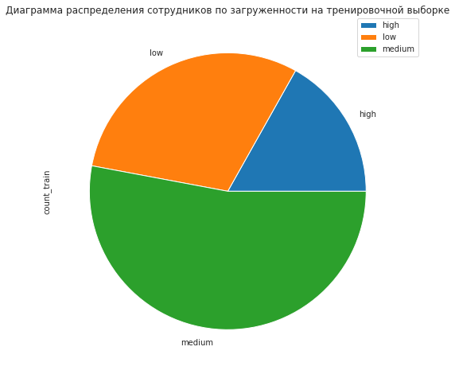
    


    
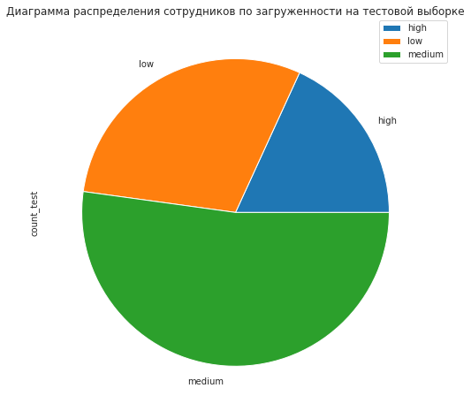
    


<div>
<style scoped>
    .dataframe tbody tr th:only-of-type {
        vertical-align: middle;
    }

    .dataframe tbody tr th {
        vertical-align: top;
    }

    .dataframe thead th {
        text-align: right;
    }
</style>
<table border="1" class="dataframe">
  <thead>
    <tr style="text-align: right;">
      <th></th>
      <th>percentage_train</th>
      <th>percentage_test</th>
    </tr>
    <tr>
      <th>workload</th>
      <th></th>
      <th></th>
    </tr>
  </thead>
  <tbody>
    <tr>
      <th>high</th>
      <td>0.1685</td>
      <td>0.1815</td>
    </tr>
    <tr>
      <th>low</th>
      <td>0.3020</td>
      <td>0.2965</td>
    </tr>
    <tr>
      <th>medium</th>
      <td>0.5295</td>
      <td>0.5215</td>
    </tr>
  </tbody>
</table>
</div>


```python
show_train_test_pie(quit_df, test_df2, 'last_year_promo', 'salary', 'Диаграмма распределения сотрудников по наличию повышения в последний год')
```


    
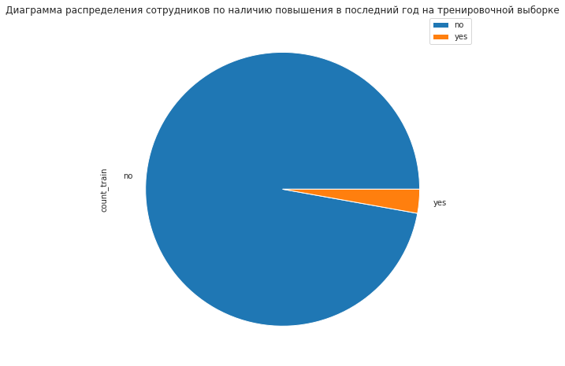
    


    
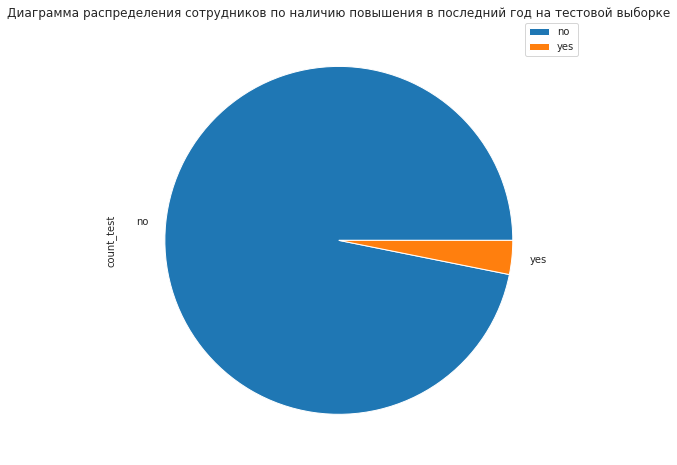
    


<div>
<style scoped>
    .dataframe tbody tr th:only-of-type {
        vertical-align: middle;
    }

    .dataframe tbody tr th {
        vertical-align: top;
    }

    .dataframe thead th {
        text-align: right;
    }
</style>
<table border="1" class="dataframe">
  <thead>
    <tr style="text-align: right;">
      <th></th>
      <th>percentage_train</th>
      <th>percentage_test</th>
    </tr>
    <tr>
      <th>last_year_promo</th>
      <th></th>
      <th></th>
    </tr>
  </thead>
  <tbody>
    <tr>
      <th>no</th>
      <td>0.97175</td>
      <td>0.9685</td>
    </tr>
    <tr>
      <th>yes</th>
      <td>0.02825</td>
      <td>0.0315</td>
    </tr>
  </tbody>
</table>
</div>


```python
show_train_test_pie(quit_df, test_df2, 'last_year_violations', 'salary', 'Диаграмма распределения сотрудников по наличию нарушений в последний год')
```


    
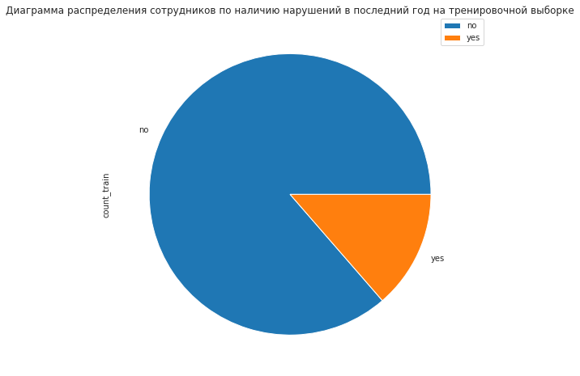
    


    
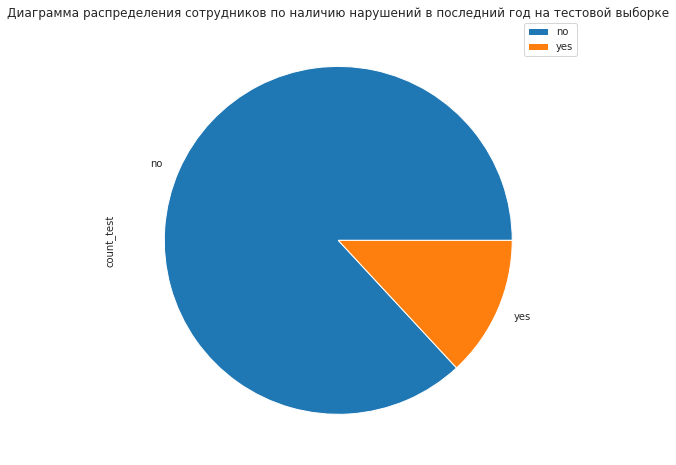
    


<div>
<style scoped>
    .dataframe tbody tr th:only-of-type {
        vertical-align: middle;
    }

    .dataframe tbody tr th {
        vertical-align: top;
    }

    .dataframe thead th {
        text-align: right;
    }
</style>
<table border="1" class="dataframe">
  <thead>
    <tr style="text-align: right;">
      <th></th>
      <th>percentage_train</th>
      <th>percentage_test</th>
    </tr>
    <tr>
      <th>last_year_violations</th>
      <th></th>
      <th></th>
    </tr>
  </thead>
  <tbody>
    <tr>
      <th>no</th>
      <td>0.86375</td>
      <td>0.869</td>
    </tr>
    <tr>
      <th>yes</th>
      <td>0.13625</td>
      <td>0.131</td>
    </tr>
  </tbody>
</table>
</div>


```python
show_train_test_pie(quit_df, test_df2, 'quit', 'salary', 'Диаграмма распределения сотрудников по наличию нарушений в последний год')
```


    
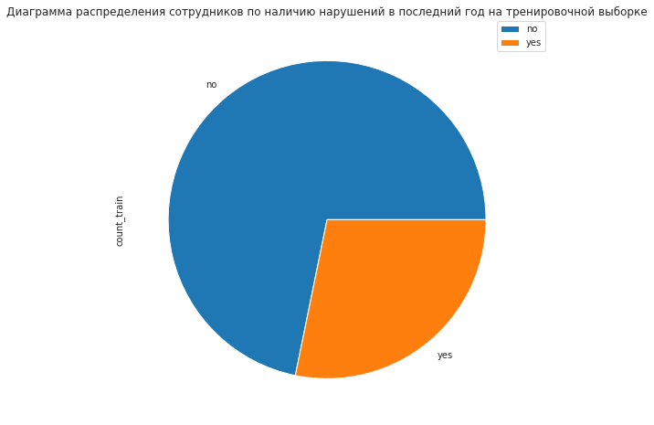
    


    
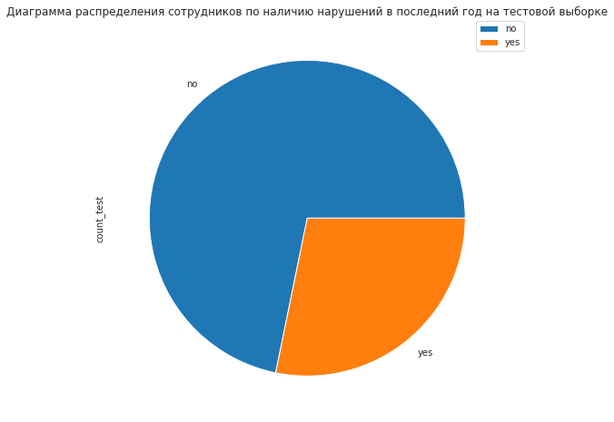
    


<div>
<style scoped>
    .dataframe tbody tr th:only-of-type {
        vertical-align: middle;
    }

    .dataframe tbody tr th {
        vertical-align: top;
    }

    .dataframe thead th {
        text-align: right;
    }
</style>
<table border="1" class="dataframe">
  <thead>
    <tr style="text-align: right;">
      <th></th>
      <th>percentage_train</th>
      <th>percentage_test</th>
    </tr>
    <tr>
      <th>quit</th>
      <th></th>
      <th></th>
    </tr>
  </thead>
  <tbody>
    <tr>
      <th>no</th>
      <td>0.718</td>
      <td>0.718</td>
    </tr>
    <tr>
      <th>yes</th>
      <td>0.282</td>
      <td>0.282</td>
    </tr>
  </tbody>
</table>
</div>


Дисбаланс в принаках очень схож с тем, что был в первой задаче:

* level - сотрудников уровня *senior* в 3 раза меньше, чем сотрудников уровня *middle* или *junior*

* last_year_promo - лишь 2.8% сторудников получало повышение в последний год

* last_year_violations - перевес в 6 раз в пользу ненарушавших трудовой договор 

По целевому признаку *quit* перевес ~в 3.5 раза в пользу не уволившихся (уволилось 28% сотрудников из выборки)

Заметных различий между тренировочной и тестовой выборками не видно

 ### Количественные признаки

#### Статистический анализ


```python
quit_df.describe()
```


<div>
<style scoped>
    .dataframe tbody tr th:only-of-type {
        vertical-align: middle;
    }

    .dataframe tbody tr th {
        vertical-align: top;
    }

    .dataframe thead th {
        text-align: right;
    }
</style>
<table border="1" class="dataframe">
  <thead>
    <tr style="text-align: right;">
      <th></th>
      <th>employment_years</th>
      <th>supervisor_evaluation</th>
      <th>salary</th>
    </tr>
  </thead>
  <tbody>
    <tr>
      <th>count</th>
      <td>4000.000000</td>
      <td>4000.000000</td>
      <td>4000.000000</td>
    </tr>
    <tr>
      <th>mean</th>
      <td>3.701500</td>
      <td>3.474750</td>
      <td>33805.800000</td>
    </tr>
    <tr>
      <th>std</th>
      <td>2.541852</td>
      <td>1.004049</td>
      <td>15152.415163</td>
    </tr>
    <tr>
      <th>min</th>
      <td>1.000000</td>
      <td>1.000000</td>
      <td>12000.000000</td>
    </tr>
    <tr>
      <th>25%</th>
      <td>2.000000</td>
      <td>3.000000</td>
      <td>22800.000000</td>
    </tr>
    <tr>
      <th>50%</th>
      <td>3.000000</td>
      <td>4.000000</td>
      <td>30000.000000</td>
    </tr>
    <tr>
      <th>75%</th>
      <td>6.000000</td>
      <td>4.000000</td>
      <td>43200.000000</td>
    </tr>
    <tr>
      <th>max</th>
      <td>10.000000</td>
      <td>5.000000</td>
      <td>96000.000000</td>
    </tr>
  </tbody>
</table>
</div>


Явных выбросов не видно

#### Графический анализ


```python
show_train_test_barplot(quit_df, test_df2, 'employment_years', 'level', 'График распределения сотрудников по стажу работы')
```


<div>
<style scoped>
    .dataframe tbody tr th:only-of-type {
        vertical-align: middle;
    }

    .dataframe tbody tr th {
        vertical-align: top;
    }

    .dataframe thead th {
        text-align: right;
    }
</style>
<table border="1" class="dataframe">
  <thead>
    <tr style="text-align: right;">
      <th></th>
      <th>percentage_train</th>
      <th>percentage_test</th>
    </tr>
    <tr>
      <th>employment_years</th>
      <th></th>
      <th></th>
    </tr>
  </thead>
  <tbody>
    <tr>
      <th>1</th>
      <td>0.24625</td>
      <td>0.2605</td>
    </tr>
    <tr>
      <th>2</th>
      <td>0.19425</td>
      <td>0.1870</td>
    </tr>
    <tr>
      <th>3</th>
      <td>0.11975</td>
      <td>0.1170</td>
    </tr>
    <tr>
      <th>4</th>
      <td>0.09825</td>
      <td>0.0935</td>
    </tr>
    <tr>
      <th>5</th>
      <td>0.09050</td>
      <td>0.0895</td>
    </tr>
    <tr>
      <th>6</th>
      <td>0.07400</td>
      <td>0.0690</td>
    </tr>
    <tr>
      <th>7</th>
      <td>0.07700</td>
      <td>0.0870</td>
    </tr>
    <tr>
      <th>8</th>
      <td>0.04350</td>
      <td>0.0455</td>
    </tr>
    <tr>
      <th>9</th>
      <td>0.03400</td>
      <td>0.0330</td>
    </tr>
    <tr>
      <th>10</th>
      <td>0.02250</td>
      <td>0.0175</td>
    </tr>
  </tbody>
</table>
</div>


    
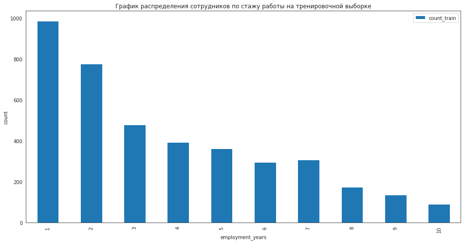
    


    
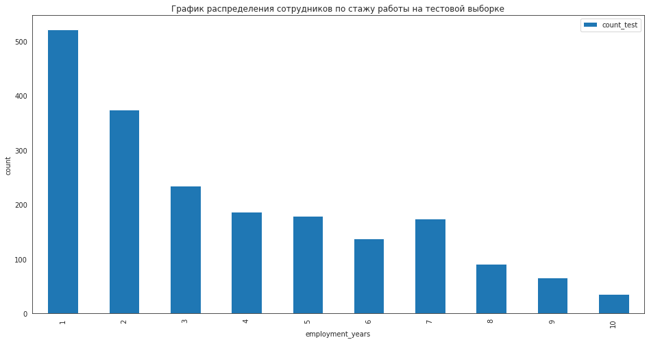
    


```python
show_train_test_barplot(quit_df, test_df2, 'supervisor_evaluation', 'level', 'График распределения сотрудников по оценке качества работы')
```


<div>
<style scoped>
    .dataframe tbody tr th:only-of-type {
        vertical-align: middle;
    }

    .dataframe tbody tr th {
        vertical-align: top;
    }

    .dataframe thead th {
        text-align: right;
    }
</style>
<table border="1" class="dataframe">
  <thead>
    <tr style="text-align: right;">
      <th></th>
      <th>percentage_train</th>
      <th>percentage_test</th>
    </tr>
    <tr>
      <th>supervisor_evaluation</th>
      <th></th>
      <th></th>
    </tr>
  </thead>
  <tbody>
    <tr>
      <th>1</th>
      <td>0.05050</td>
      <td>0.0440</td>
    </tr>
    <tr>
      <th>2</th>
      <td>0.09775</td>
      <td>0.0980</td>
    </tr>
    <tr>
      <th>3</th>
      <td>0.30825</td>
      <td>0.2870</td>
    </tr>
    <tr>
      <th>4</th>
      <td>0.41350</td>
      <td>0.4285</td>
    </tr>
    <tr>
      <th>5</th>
      <td>0.13000</td>
      <td>0.1420</td>
    </tr>
  </tbody>
</table>
</div>


    
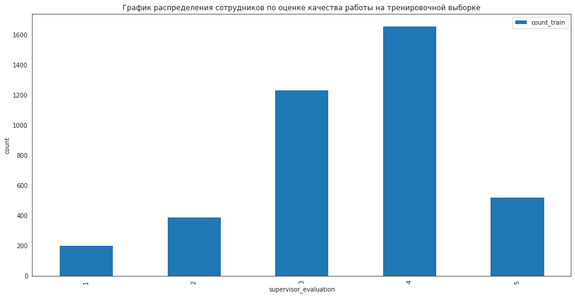
    


    
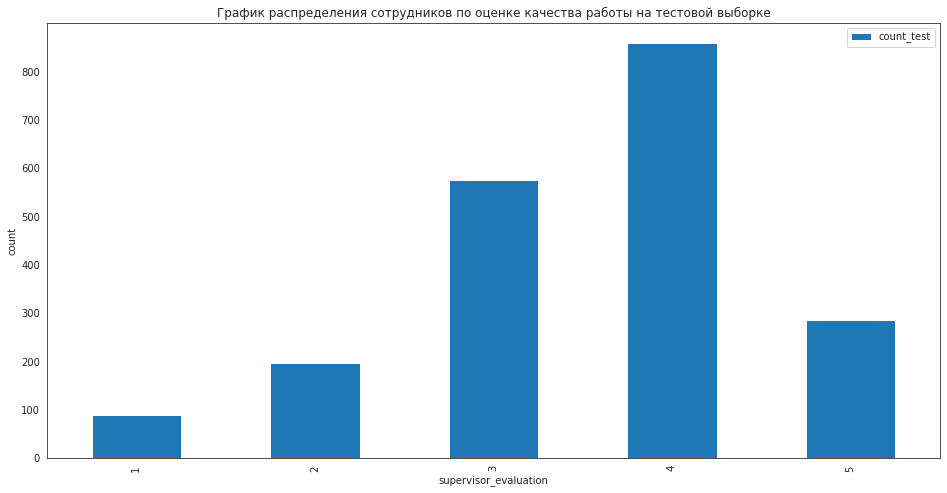
    


```python
show_hist_boxplot(quit_df, 'salary', 20, 'Гистограмма распределения сотрудников по зарплатам (трен. выборка)', 'Диаграмма размаха сотрудников по зарплатам (трен. выборка)')
show_hist_boxplot(test_df2, 'salary', 20, 'Гистограмма распределения сотрудников по зарплатам (тест. выборка)', 'Диаграмма размаха сотрудников по зарплатам (тест. выборка)')
```


    
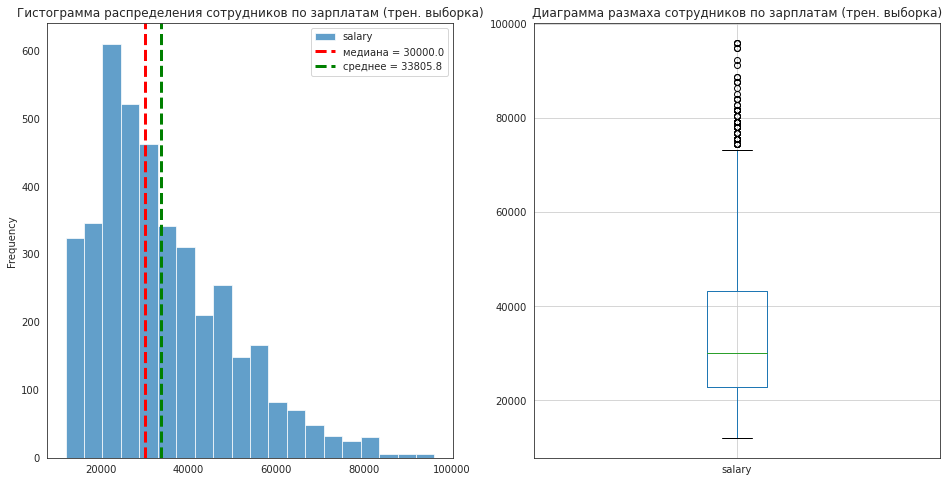
    


    
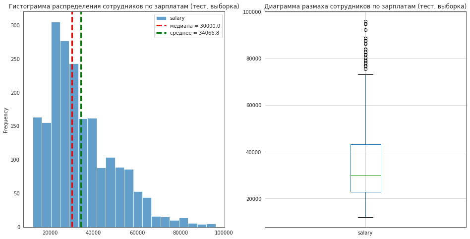
    


Выводы из анализа количественных признаков тренировочной выборки:

* Количество людей по стажу работы планомерно снижается

* Оценка качества работы нормальная - большинство оценок - 3 и 4

* Зарплаты распределены близко к Пуассоновскому распределению (из-за хвоста справа)

Сильных различий между распределениями в тестовой и тренировочной выборке нет

### Корреляционный анализ

Построим матрицу корреляции используя коэффициент корреляции $\phi_k$


```python
phik_coef_train = quit_df.phik_matrix(interval_cols = ['salary'])

plot_correlation_matrix(
    phik_coef_train.values,
    x_labels = phik_coef_train.columns,
    y_labels = phik_coef_train.index,
    title = 'Матрица корреляции $\phi_k$',
    figsize=(15, 12),
    fontsize_factor=1.5
)

phik_coef_test = test_df2.phik_matrix(interval_cols = ['salary'])

plot_correlation_matrix(
    phik_coef_test.values,
    x_labels = phik_coef_test.columns,
    y_labels = phik_coef_test.index,
    title = 'Матрица корреляции $\phi_k$',
    figsize=(15, 12),
    fontsize_factor=1.5
)
```


    
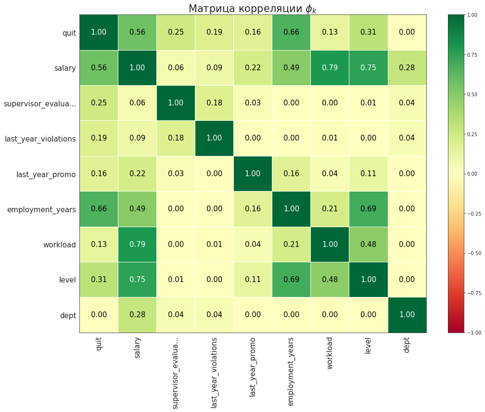
    


    
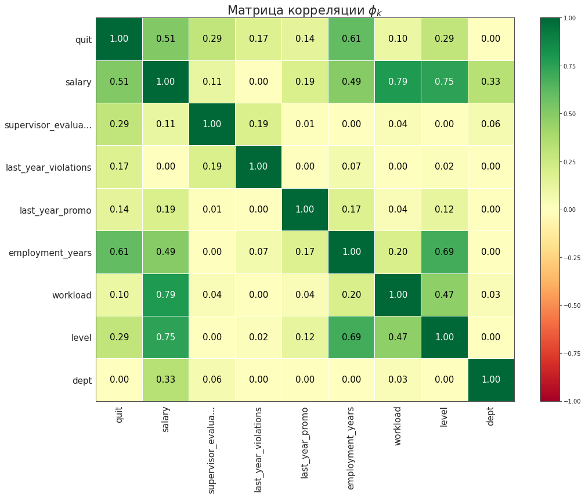
    


Корреляция Между зарплатой и уровнем работника составляет 0.75, а между зарплатой и загруженность 0.79, что близко к сильной корреляции. Поэтому при обучении модели возможно стоит избавиться от некоторых признаков

Также видна заметная корреляция:

* Между стажем и уровнем

* Между стажем и "склонностью к увольнению"

* Между зарплатой и "склонностью к увольнению"

Если говорить наоборот о слабой корреляции, то видно, что признак *dept* имеет нулевую корреляцию с целевым *quit*. Так что необходимость его наличия в обучаемой модели также под вопросом

Посмотрим на матрицу рассеяния в координатах *dept* и *salary* с учётом уровня загруженности


```python
show_scatter_corr(quit_df, 'dept', 'salary', 'Диаграмма рассеяния зарплаты от уровня загруженности', 'workload')
```


    
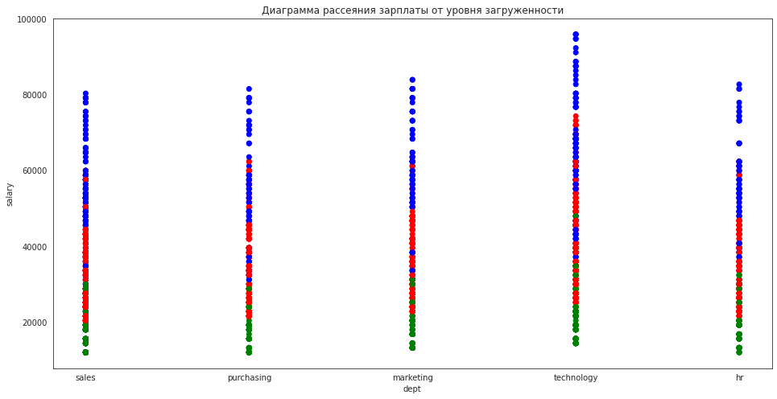
    


Действительно видно чёткое разделение между зарплатами по уровню загруженности

### Анализ портрета уволившегося работника

Посмотрим на распределение признаков у сотрудников, которые уволились и у тех, которые остались, и составим общий портрет уволившегося сотрудника.

#### Анализ признаков

##### Анализ категориальных признаков


```python
def show_quit_pie(df1, df2, col, val, tit):
    temp1 = pd.pivot_table(df1, index = col, values = val, aggfunc = 'count')
    temp1.columns = ['count_yes']
    temp1['percentage_quited'] = temp1['count_yes']/len(df1)
    temp1.plot(kind = 'pie', y = 'count_yes', title = tit + " для уволившихся сотрудников")
    plt.legend(bbox_to_anchor=( 1.05 , 1 ), loc='best', borderaxespad= 0)
    
    
    temp2 = pd.pivot_table(df2, index = col, values = val, aggfunc = 'count')
    temp2.columns = ['count_no']
    temp2['percentage_not_quited'] = temp2['count_no']/len(df2)
    temp2.plot(kind = 'pie', y = 'count_no', title = tit + " для не уволившихся сотрудников")
    plt.legend(bbox_to_anchor=( 1.05 , 1 ), loc='best', borderaxespad= 0)
    
    plt.show()
    display(temp1.join(temp2)[['percentage_quited', 'percentage_not_quited']])
```


```python
show_quit_pie(quit_df.query('quit == "yes"'), quit_df.query('quit == "no"'), 'dept', 'salary', 'Диаграмма распределения сотрудников по отделу')
```


    

    


    

    


<div>
<style scoped>
    .dataframe tbody tr th:only-of-type {
        vertical-align: middle;
    }

    .dataframe tbody tr th {
        vertical-align: top;
    }

    .dataframe thead th {
        text-align: right;
    }
</style>
<table border="1" class="dataframe">
  <thead>
    <tr style="text-align: right;">
      <th></th>
      <th>percentage_quited</th>
      <th>percentage_not_quited</th>
    </tr>
    <tr>
      <th>dept</th>
      <th></th>
      <th></th>
    </tr>
  </thead>
  <tbody>
    <tr>
      <th>hr</th>
      <td>0.102837</td>
      <td>0.121170</td>
    </tr>
    <tr>
      <th>marketing</th>
      <td>0.144504</td>
      <td>0.145891</td>
    </tr>
    <tr>
      <th>purchasing</th>
      <td>0.147163</td>
      <td>0.146936</td>
    </tr>
    <tr>
      <th>sales</th>
      <td>0.360816</td>
      <td>0.358983</td>
    </tr>
    <tr>
      <th>technology</th>
      <td>0.244681</td>
      <td>0.227019</td>
    </tr>
  </tbody>
</table>
</div>


```python
show_quit_pie(quit_df.query('quit == "yes"'), quit_df.query('quit == "no"'), 'level', 'salary', 'Диаграмма распределения сотрудников по должности')
```


    
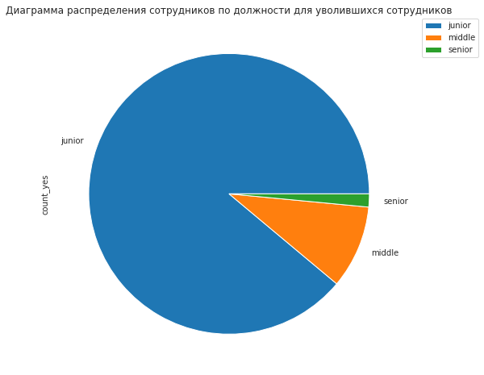
    


    
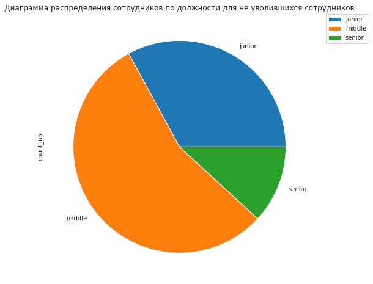
    


<div>
<style scoped>
    .dataframe tbody tr th:only-of-type {
        vertical-align: middle;
    }

    .dataframe tbody tr th {
        vertical-align: top;
    }

    .dataframe thead th {
        text-align: right;
    }
</style>
<table border="1" class="dataframe">
  <thead>
    <tr style="text-align: right;">
      <th></th>
      <th>percentage_quited</th>
      <th>percentage_not_quited</th>
    </tr>
    <tr>
      <th>level</th>
      <th></th>
      <th></th>
    </tr>
  </thead>
  <tbody>
    <tr>
      <th>junior</th>
      <td>0.889184</td>
      <td>0.329387</td>
    </tr>
    <tr>
      <th>middle</th>
      <td>0.095745</td>
      <td>0.552228</td>
    </tr>
    <tr>
      <th>senior</th>
      <td>0.015071</td>
      <td>0.118384</td>
    </tr>
  </tbody>
</table>
</div>


```python
show_quit_pie(quit_df.query('quit == "yes"'), quit_df.query('quit == "no"'), 'workload', 'salary', 'Диаграмма распределения сотрудников по загруженности')
```


    
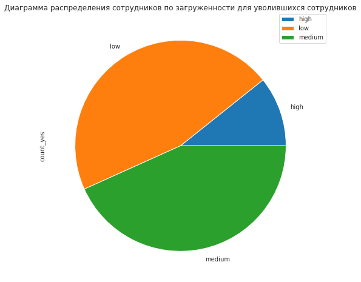
    


    
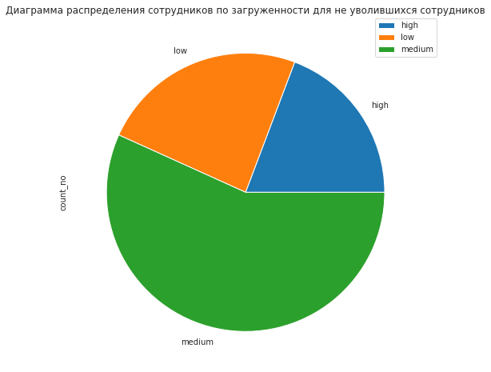
    


<div>
<style scoped>
    .dataframe tbody tr th:only-of-type {
        vertical-align: middle;
    }

    .dataframe tbody tr th {
        vertical-align: top;
    }

    .dataframe thead th {
        text-align: right;
    }
</style>
<table border="1" class="dataframe">
  <thead>
    <tr style="text-align: right;">
      <th></th>
      <th>percentage_quited</th>
      <th>percentage_not_quited</th>
    </tr>
    <tr>
      <th>workload</th>
      <th></th>
      <th></th>
    </tr>
  </thead>
  <tbody>
    <tr>
      <th>high</th>
      <td>0.107270</td>
      <td>0.192549</td>
    </tr>
    <tr>
      <th>low</th>
      <td>0.460106</td>
      <td>0.239903</td>
    </tr>
    <tr>
      <th>medium</th>
      <td>0.432624</td>
      <td>0.567549</td>
    </tr>
  </tbody>
</table>
</div>


```python
show_quit_pie(quit_df.query('quit == "yes"'), quit_df.query('quit == "no"'), 'last_year_promo', 'salary', 'Диаграмма распределения сотрудников по наличию повышения в последний год')
```


    
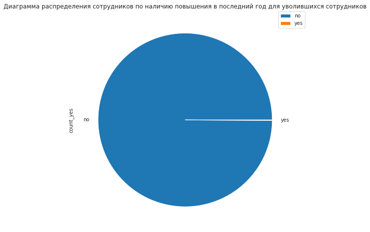
    


    
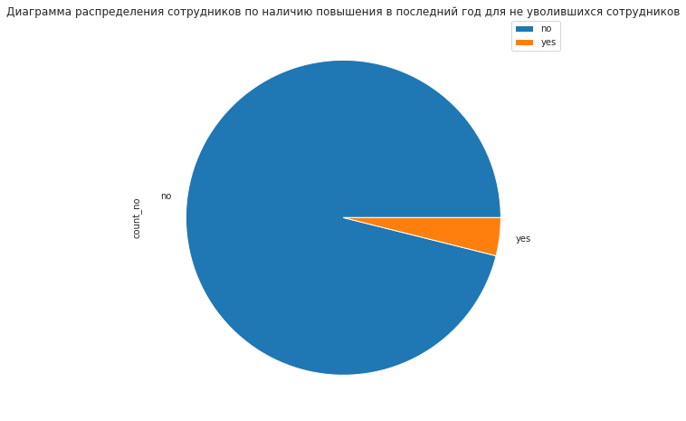
    


<div>
<style scoped>
    .dataframe tbody tr th:only-of-type {
        vertical-align: middle;
    }

    .dataframe tbody tr th {
        vertical-align: top;
    }

    .dataframe thead th {
        text-align: right;
    }
</style>
<table border="1" class="dataframe">
  <thead>
    <tr style="text-align: right;">
      <th></th>
      <th>percentage_quited</th>
      <th>percentage_not_quited</th>
    </tr>
    <tr>
      <th>last_year_promo</th>
      <th></th>
      <th></th>
    </tr>
  </thead>
  <tbody>
    <tr>
      <th>no</th>
      <td>0.999113</td>
      <td>0.961003</td>
    </tr>
    <tr>
      <th>yes</th>
      <td>0.000887</td>
      <td>0.038997</td>
    </tr>
  </tbody>
</table>
</div>


```python
show_quit_pie(quit_df.query('quit == "yes"'), quit_df.query('quit == "no"'), 'last_year_violations', 'salary', 'Диаграмма распределения сотрудников по наличию нарушений в последний год')
```


    
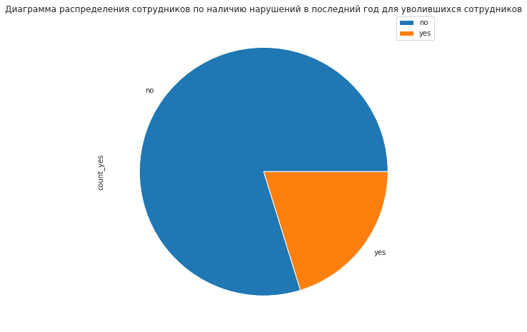
    


    
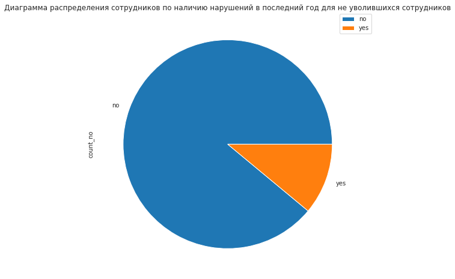
    


<div>
<style scoped>
    .dataframe tbody tr th:only-of-type {
        vertical-align: middle;
    }

    .dataframe tbody tr th {
        vertical-align: top;
    }

    .dataframe thead th {
        text-align: right;
    }
</style>
<table border="1" class="dataframe">
  <thead>
    <tr style="text-align: right;">
      <th></th>
      <th>percentage_quited</th>
      <th>percentage_not_quited</th>
    </tr>
    <tr>
      <th>last_year_violations</th>
      <th></th>
      <th></th>
    </tr>
  </thead>
  <tbody>
    <tr>
      <th>no</th>
      <td>0.797872</td>
      <td>0.889624</td>
    </tr>
    <tr>
      <th>yes</th>
      <td>0.202128</td>
      <td>0.110376</td>
    </tr>
  </tbody>
</table>
</div>


Что мы видим:

* Со всех отделов увольняется примерно одинаковое число людей

* Абсолютное большинство уволившихся (~89%) были сотрудниками уровня junior,  в то время как среди неуволившихся их лишь 33%

* Сотрудники с низкой загруженностью увольняются чаще: среди уволившихся таких 46%, в то время как среди неуволившихся лишь 24%

* Крайне малое число сотрудников, которые уволились, получали повышение в последний год - менее 0.01% среди всех уволившихся получали повышение, в то время как среди оставшихся этот показатель около 3.8%

* Уволившиеся сотрудники в среднем нарушали трудовой договор в 2 раза чаще, чем оставшиеся (20% против 11%)

##### Анализ количественных признаков


```python
def show_quit_barplot(df1, df2, col, val, tit):    
    temp1 = pd.pivot_table(df1, index = col, values = val, aggfunc = 'count')
    temp1.columns = ['count_yes']
    temp1['percentage_quited'] = temp1['count_yes']/len(df1)
    
    temp2 = pd.pivot_table(df2, index = col, values = val, aggfunc = 'count')
    temp2.columns = ['count_no']
    temp2['percentage_not_quited'] = temp2['count_no']/len(df2)
    
    temp = temp1.join(temp2)[['percentage_quited', 'percentage_not_quited']]
    display(temp)
    
    temp[col] = pd.Series([i for i in range(len(temp) + 1)])
    X_axis = np.arange(len(temp)) 
  
    plt.bar(X_axis - 0.2, temp['percentage_quited'], 0.4, label = 'Уволившиеся сотрудники') 
    plt.bar(X_axis + 0.2, temp['percentage_not_quited'], 0.4, label = 'Оставшиеся сотрудники') 

    plt.xticks(X_axis, temp[col] ) 
    plt.xlabel(col) 
    plt.ylabel("Percentage") 
    plt.title(tit) 
    plt.legend() 
    plt.show()
```


```python
show_quit_barplot(quit_df.query('quit == "yes"'), quit_df.query('quit == "no"'), 'employment_years', 'level', 'Распределение сотрудников по стажу в процентом соотношении с разделением на уволившихся и оставшихся')

```


<div>
<style scoped>
    .dataframe tbody tr th:only-of-type {
        vertical-align: middle;
    }

    .dataframe tbody tr th {
        vertical-align: top;
    }

    .dataframe thead th {
        text-align: right;
    }
</style>
<table border="1" class="dataframe">
  <thead>
    <tr style="text-align: right;">
      <th></th>
      <th>percentage_quited</th>
      <th>percentage_not_quited</th>
    </tr>
    <tr>
      <th>employment_years</th>
      <th></th>
      <th></th>
    </tr>
  </thead>
  <tbody>
    <tr>
      <th>1</th>
      <td>0.531028</td>
      <td>0.134401</td>
    </tr>
    <tr>
      <th>2</th>
      <td>0.257092</td>
      <td>0.169568</td>
    </tr>
    <tr>
      <th>3</th>
      <td>0.144504</td>
      <td>0.110028</td>
    </tr>
    <tr>
      <th>4</th>
      <td>0.023936</td>
      <td>0.127437</td>
    </tr>
    <tr>
      <th>5</th>
      <td>0.020390</td>
      <td>0.118036</td>
    </tr>
    <tr>
      <th>6</th>
      <td>0.008865</td>
      <td>0.099582</td>
    </tr>
    <tr>
      <th>7</th>
      <td>0.006206</td>
      <td>0.104805</td>
    </tr>
    <tr>
      <th>8</th>
      <td>0.002660</td>
      <td>0.059540</td>
    </tr>
    <tr>
      <th>9</th>
      <td>0.002660</td>
      <td>0.046309</td>
    </tr>
    <tr>
      <th>10</th>
      <td>0.002660</td>
      <td>0.030292</td>
    </tr>
  </tbody>
</table>
</div>


    
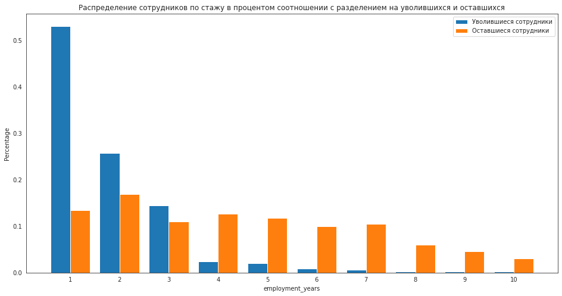
    


```python
show_quit_barplot(quit_df.query('quit == "yes"'), quit_df.query('quit == "no"'), 'supervisor_evaluation', 'level', 'Распределение сотрудников по оценке качества работы в процентом соотношении с разделением на уволившихся и оставшихся')
```


<div>
<style scoped>
    .dataframe tbody tr th:only-of-type {
        vertical-align: middle;
    }

    .dataframe tbody tr th {
        vertical-align: top;
    }

    .dataframe thead th {
        text-align: right;
    }
</style>
<table border="1" class="dataframe">
  <thead>
    <tr style="text-align: right;">
      <th></th>
      <th>percentage_quited</th>
      <th>percentage_not_quited</th>
    </tr>
    <tr>
      <th>supervisor_evaluation</th>
      <th></th>
      <th></th>
    </tr>
  </thead>
  <tbody>
    <tr>
      <th>1</th>
      <td>0.084220</td>
      <td>0.037256</td>
    </tr>
    <tr>
      <th>2</th>
      <td>0.145390</td>
      <td>0.079039</td>
    </tr>
    <tr>
      <th>3</th>
      <td>0.463652</td>
      <td>0.247214</td>
    </tr>
    <tr>
      <th>4</th>
      <td>0.253546</td>
      <td>0.476323</td>
    </tr>
    <tr>
      <th>5</th>
      <td>0.053191</td>
      <td>0.160167</td>
    </tr>
  </tbody>
</table>
</div>


    
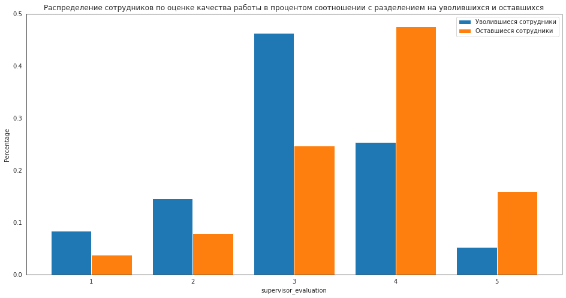
    


```python
show_hist_boxplot(quit_df.query('quit == "yes"'), 'salary', 20, 'Гистограмма распределения сотрудников по зарплатам (уволившиеся)', 'Диаграмма размаха сотрудников по зарплатам (уволившиеся)')
show_hist_boxplot(quit_df.query('quit == "no"'), 'salary', 20, 'Гистограмма распределения сотрудников по зарплатам (оставшиеся)', 'Диаграмма размаха сотрудников по зарплатам (оставшиеся)')

sns.histplot(quit_df.query('quit == "yes"')['salary'], color = 'blue', bins = 20, stat='density', common_norm=False, label = 'quited')
sns.histplot(quit_df.query('quit == "no"')['salary'], color = 'red', bins = 20, stat='density', common_norm=False, label = 'not quited')

plt.axvline(x=np.nanmean (quit_df.query('quit == "yes"')['salary']), color='blue', linestyle='--', linewidth= 3 , label='среднее (для уволившихся) = ' + str(round(quit_df.query('quit == "yes"')['salary'].mean(), 2))) 
plt.axvline(x=np.nanmean (quit_df.query('quit == "no"')['salary']), color='red', linestyle='--', linewidth= 3 , label='среднее (для оставшихся) = ' + str(round(quit_df.query('quit == "no"')['salary'].mean(), 2))) 
plt.legend()
plt.show()
```


    
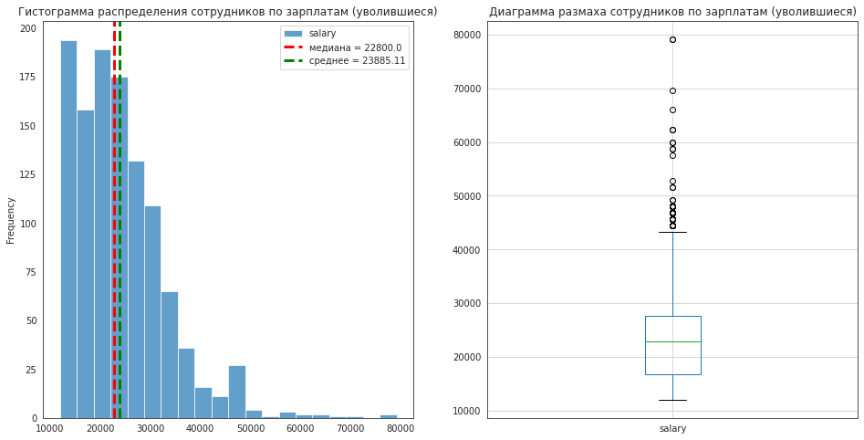
    


    
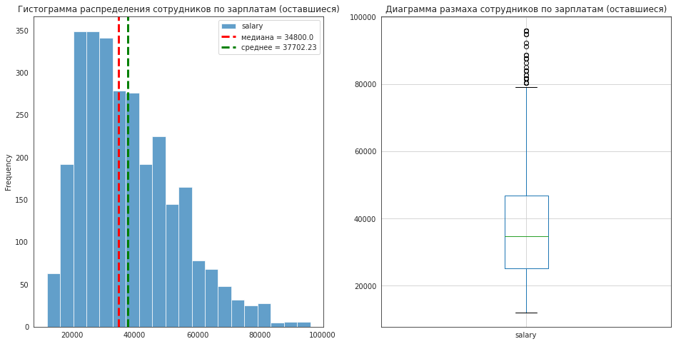
    


    
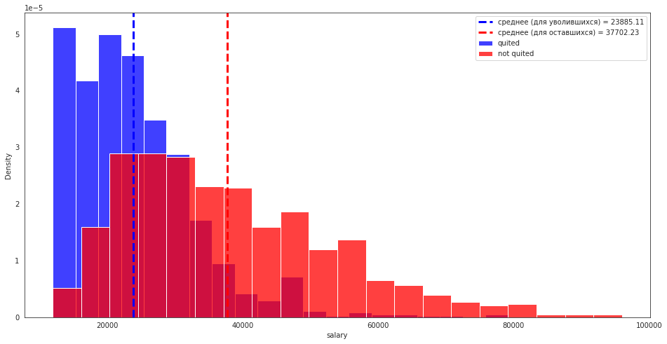
    


Видно, что:

* Половина уволившихся работала в компании год, еше 25% - второй год. Доля проработавших более 3 лет среди уволившихся очень мала

* Оценка качества работы сотрудников, которые уволились несколько ниже чем у неуволившихся

* Зарплаты у уволившихся в среднем ~ в 1.6 раз ниже, чем у оставшихся (что объясняется тем, что это по большей части "джуны" с малым стажем)

#### Портрет уволившегося сотрудника

Из вышепоказанного составим портрет среднестатистического уволившегося сотрудника:

* Чаще всего сотрудник уровня *junior*, проработавший в компании менее 3 лет

* Практически наверняка не получал повышения в последний год

* Зарплата ниже средней (в среднем в 1.6 раза меньше, чем у оставшихся сотрудников)

* С большей вероятностью, чем неуволившийся, нарушал трудовой договор в последний год

* Загруженность в среднем ниже, чем у неуволившихся сотрудников

### Зависимость увольнения от удволетворенности работой

Проведём иследование на тестовой выборке: сравним распределение признака *job_satisfaction_rate* у уволившихся и оставшихся сотрудников


```python
rate_quit_df = test_rate_df.join(test_quit_df)
quited_rate = rate_quit_df.query('quit == "yes"')['job_satisfaction_rate']
not_quited_rate = rate_quit_df.query('quit == "no"')['job_satisfaction_rate']
```


```python
sns.histplot(quited_rate, color = 'blue', bins = 30, stat='density', common_norm=False, label = 'quited')
sns.histplot(not_quited_rate, color = 'red', bins = 30, stat='density', common_norm=False, label = 'not quited')

plt.axvline(x=np.nanmean (quited_rate), color='blue', linestyle='--', linewidth= 3 , label='медиана (для уволившихся) = ' + str(quited_rate.median())) 
plt.axvline(x=np.nanmean (not_quited_rate), color='red', linestyle='--', linewidth= 3 , label='медиана (для оставшихся) = ' + str(not_quited_rate.median())) 
plt.legend()

plt.show()
```


    
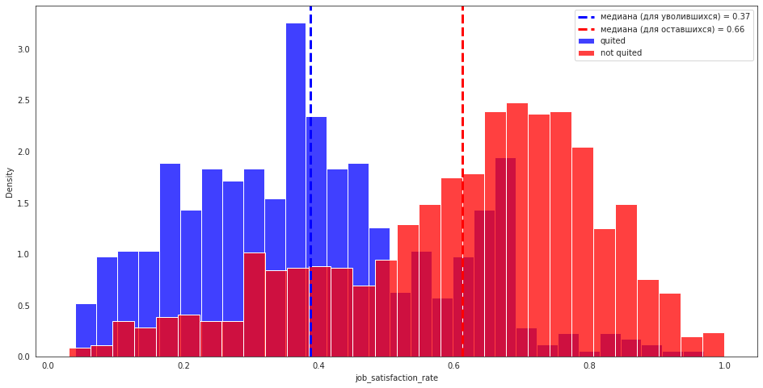
    


Как мы видим, распределения различаются: у уволившихся пик распределения медиана 0.37, у оставшихя - 0.66. Также видно, что доля людей с уровнем удволетворенности больше 0.7 среди уволившихся крайне мала, ровно как и меньше 0.3 среди оставшихся.

Из этого можно сделать вывод, что уровень удовлетворённости сотрудника работой в компании действительно влияет на то, уволится ли сотрудник

## Добавление признаков

### Добавление признака *job_satisfaction_rate_predict*

Добавим в таблицу признак *job_satisfaction_rate_predict*, который предскажет наша модель из предыдущей задачи


```python
quit_df['job_satisfaction_rate_predict'] = rate_model.predict(quit_df.drop(['quit'], axis = 1))
```

Также признак нужно добавить и в тестовую выборку. 


```python
test_df2['job_satisfaction_rate_predict'] = rate_model.predict(test_df2.drop(['quit'], axis = 1))
test_df2.head()
```


<div>
<style scoped>
    .dataframe tbody tr th:only-of-type {
        vertical-align: middle;
    }

    .dataframe tbody tr th {
        vertical-align: top;
    }

    .dataframe thead th {
        text-align: right;
    }
</style>
<table border="1" class="dataframe">
  <thead>
    <tr style="text-align: right;">
      <th></th>
      <th>dept</th>
      <th>level</th>
      <th>workload</th>
      <th>employment_years</th>
      <th>last_year_promo</th>
      <th>last_year_violations</th>
      <th>supervisor_evaluation</th>
      <th>salary</th>
      <th>quit</th>
      <th>job_satisfaction_rate_predict</th>
    </tr>
    <tr>
      <th>id</th>
      <th></th>
      <th></th>
      <th></th>
      <th></th>
      <th></th>
      <th></th>
      <th></th>
      <th></th>
      <th></th>
      <th></th>
    </tr>
  </thead>
  <tbody>
    <tr>
      <th>485046</th>
      <td>marketing</td>
      <td>junior</td>
      <td>medium</td>
      <td>2</td>
      <td>no</td>
      <td>no</td>
      <td>5</td>
      <td>28800</td>
      <td>no</td>
      <td>0.866667</td>
    </tr>
    <tr>
      <th>686555</th>
      <td>hr</td>
      <td>junior</td>
      <td>medium</td>
      <td>1</td>
      <td>no</td>
      <td>no</td>
      <td>4</td>
      <td>30000</td>
      <td>no</td>
      <td>0.678750</td>
    </tr>
    <tr>
      <th>467458</th>
      <td>sales</td>
      <td>middle</td>
      <td>low</td>
      <td>5</td>
      <td>no</td>
      <td>no</td>
      <td>4</td>
      <td>19200</td>
      <td>no</td>
      <td>0.717692</td>
    </tr>
    <tr>
      <th>418655</th>
      <td>sales</td>
      <td>middle</td>
      <td>low</td>
      <td>6</td>
      <td>no</td>
      <td>no</td>
      <td>4</td>
      <td>19200</td>
      <td>no</td>
      <td>0.713333</td>
    </tr>
    <tr>
      <th>789145</th>
      <td>hr</td>
      <td>middle</td>
      <td>medium</td>
      <td>5</td>
      <td>no</td>
      <td>no</td>
      <td>5</td>
      <td>40800</td>
      <td>no</td>
      <td>0.809474</td>
    </tr>
  </tbody>
</table>
</div>


### Анализ признака


```python
display(quit_df['job_satisfaction_rate_predict'].describe())
```


    count    4000.000000
    mean        0.536237
    std         0.215670
    min         0.060000
    25%         0.348000
    50%         0.544000
    75%         0.690000
    max         0.985000
    Name: job_satisfaction_rate_predict, dtype: float64


```python
show_hist_boxplot(quit_df, 'job_satisfaction_rate_predict', 50, 'Гистограмма распределения сотрудников по уровню удволетворённости', 'Диаграмма размаха сотрудников по уровню удволетворённости')
```


    
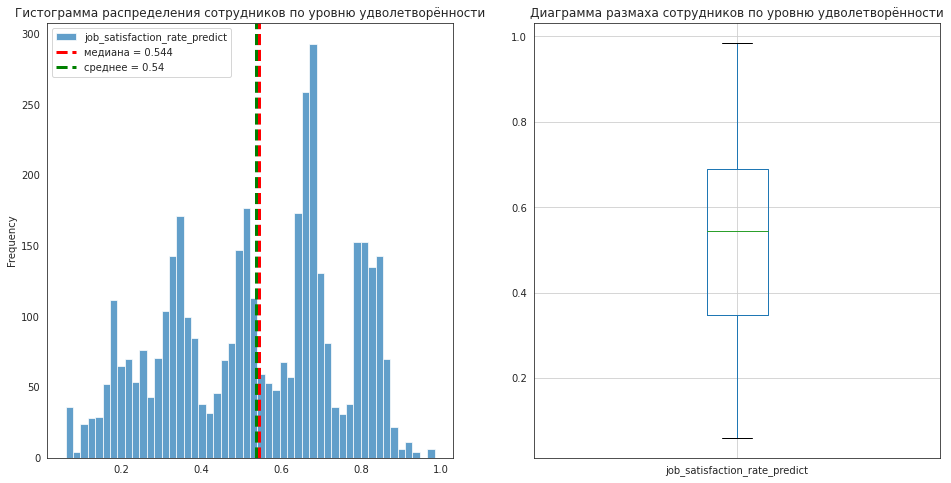
    


Как мы видим, распределение обладает скорее мультимодальным видом (есть 4 или 5 отчётливых пиков), однако выбросов на диаграмме размаха нет

Теперь взгянем на обновленную матрицу корреляции


```python
phik_coef = quit_df.phik_matrix(interval_cols = ['job_satisfaction_rate_predict'])

plot_correlation_matrix(
    phik_coef.values,
    x_labels = phik_coef.columns,
    y_labels = phik_coef.index,
    title = 'Матрица корреляции $\phi_k$',
    figsize=(15, 12),
    fontsize_factor=1.5
)
```


    
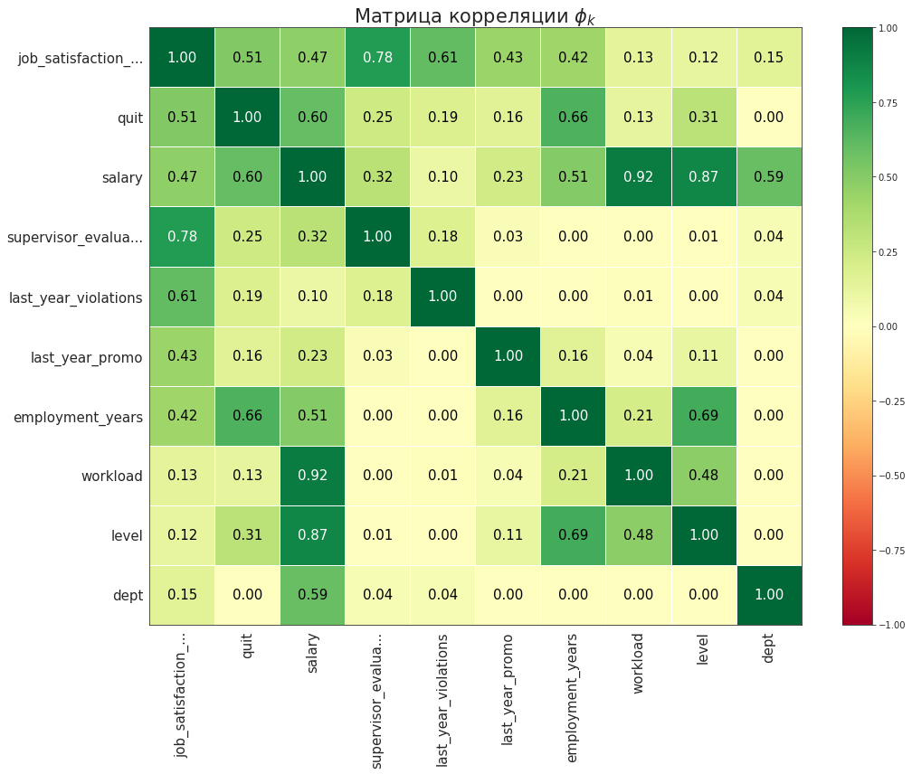
    


Сильных изменений в матрице нет. Стоит только добавить, что новый признак обладает значительной корреляцией с признаком *supervisor_evaluation*

## Подготовка данных

Пайплайн для предобработки заново писать не нужно: подойдёт тот, что был написан в первой задаче. Стоит только обновить списки столбцов для масштабирования и кодирования


```python
ord_col_default = ['level', 'workload']
ord_cats_default = [['junior', 'middle', 'senior'], ['low', 'medium', 'high']]
ohe_col_default = ['dept', 'last_year_violations', 'last_year_promo']
num_col_default = quit_df.select_dtypes(['int', 'float']).columns.tolist()
```

## Обучение модели

В этой задаче качество модели мы будем оценивать при помощи метрики roc-auc. Также помимо гиперпараметров переберём и список используемых признаков: обучим модель со всеми признаками, без *workload*, без *workload* и *dept*, а также без *workload*, *dept* и *level* (объяснения по "лишним" признакам даны в корреляционном анализе)


```python
def grid_quit_model(drop_cols):
    ord_col = []
    ord_cats = []
    ohe_col = []
    num_col = []
    
    for i in range(len(ord_col_default)):# удаляем из стписков столбцов для кодирования/масштабирования те, что в обучении модели не участвуют
        if not (ord_col_default[i] in drop_cols):
            ord_col.append(ord_col_default[i])
            ord_cats.append(ord_cats_default[i])
    
    for col in ohe_col_default:
        if not (col in drop_cols):
            ohe_col.append(col)
            
    for col in num_col_default:
        if not (col in drop_cols):
            num_col.append(col)
    
    
    ord_pipe = Pipeline(
        [
            (
                'simpleImputer_before_ord', 
                SimpleImputer(missing_values=np.nan, strategy='most_frequent')
            ),

            (
                'ord', OrdinalEncoder(handle_unknown = 'use_encoded_value',\
                                   unknown_value=np.nan, categories = ord_cats)
            ),

            (
             'simpleImputer_after_ord', 
                SimpleImputer(missing_values=np.nan, strategy='most_frequent')
            )
        ]
    )
    
    preprocessor_pipe = ColumnTransformer(
        [
        ('ohe', ohe_pipe, ohe_col),
        ('ord', ord_pipe, ord_col),
        ('num', RobustScaler(), num_col)
        ],
        remainder = 'passthrough'
    )

    pipe_final = Pipeline(
        [
            ('preprocessor', preprocessor_pipe),
            ('model', None)
        ]
    )
    
    X_train = quit_df.drop(drop_cols, axis = 1)
    lab = LabelEncoder()
    lab.fit(quit_df['quit'])
    y_train = lab.transform(quit_df['quit'])
    param_grid = [
        {
            'model': [KNeighborsClassifier()],
            'model__n_neighbors': range(2, 10)
        },

        {
            'model': [DecisionTreeClassifier(random_state = RANDOM_STATE)],
            'model__max_depth': [2, 5, 10],
            'model__min_samples_split': [1, 2, 5],
            'model__min_samples_leaf': [1, 2, 5]
        },

        {
            'model': [SVC(random_state = RANDOM_STATE, probability = True)],
            'model__kernel':['linear'],
            'model__C': [0.1, 1, 10]
        },

        {
            'model': [SVC(random_state = RANDOM_STATE, probability = True)],
            'model__kernel':['rbf'],
            'model__gamma': [0.0001, 0.001, 0.01]
        }
    ]

    grid_search = GridSearchCV(
        pipe_final,
        param_grid=param_grid, 
        cv = KFold(n_splits=5, shuffle=True, random_state=RANDOM_STATE),
        scoring='roc_auc',
        n_jobs=-1
    )

    grid_search.fit(X_train, y_train)
    
    if len(drop_cols) == 1:
        print('Модель, обученная с использованием всех признаков')
    else:
        print('Модель, обученная на данных без столбцов', drop_cols[1:])
    
    print('Метрика roc-auc лучшей модели при кросс-валидации на тренировочной выборке', abs(round(grid_search.best_score_, 3)))
    return  grid_search.best_estimator_
```


```python
model1 = grid_quit_model(['quit'])
print('\n -------------------------------------------------- \n')
model2 = grid_quit_model(['quit', 'workload'])
print('\n -------------------------------------------------- \n')
model3 = grid_quit_model(['quit', 'workload', 'dept'])
print('\n -------------------------------------------------- \n')
model4 = grid_quit_model(['quit', 'workload', 'dept', 'level'])
```

Как мы видим, самой качественной моделью всё же оказалась та, которая была обучена при помощи всех имеющихся данных

Посмотрим на эту модель и её результат на тестовой выборке


```python
quit_model = model1
print('Лучшая модель и её параметры:\n\n', quit_model)

X_test = test_df2.drop(['quit'], axis = 1)
y_test = test_df2['quit']

y_pred_proba = quit_model.predict_proba(X_test)[:, 1]
print('Метрика roc-auc лучшей модели на тестовой выборке', round(roc_auc_score(y_test, y_pred_proba), 3))
```

Лучшей моделью оказалась модель KNeighborsClassifier с учитываемым числом соседей 9. Метрика roc-auc на тестовой выборке составила 0.91

Посмотрим на значимости признаков в работе модели

## Анализ значимости признаков


```python
X_test = test_df2.drop(['quit'], axis = 1)
y_test = test_df2['quit']
permutation = permutation_importance(quit_model, X_test, y_test, scoring=make_scorer(roc_auc_score))
feature_importance = pd.DataFrame({'Feature': X_test.columns, 'Importance': permutation['importances_mean']})
feature_importance = feature_importance.sort_values('Importance', ascending=True)
sns.set_style('white')
feature_importance.plot(x='Feature', y='Importance', kind='barh', figsize=(10, 6), title = 'Важность признаков для модели') 
plt.xlabel('Importance')
plt.show()
```

Самыми важными признаками для модели оказались *level* - уровень сотрудника, *job_satisfaction_rate_predict* - предсказанный уровень удволетворённости сотрудника и *employment_years* - стаж сотрудника. В то время как признаки *last_year_violations* и *last_year_promo* почти не влияют на решение модели. Посмотрим, как именно эти признаки влияют на целевой


```python
X_test_small = X_test.head(200)
X_test_transformed = quit_model.named_steps['preprocessor'].transform(X_test_small)

explainer = shap.Explainer(quit_model.named_steps['model'].predict,\
                          X_test_transformed,\
                          feature_names = quit_model.named_steps['preprocessor'].get_feature_names_out())

shap_values = explainer(X_test_transformed)
shap.summary_plot(shap_values, max_display = len(X_test_transformed), show=False)

ax = plt.gca()

ax.set_title("График Shap-значений признаков", fontdict={"size":15})
ax.set_ylabel("Feature", fontsize=13)
plt.show()
```

Итого, в среднем:

* Чем ниже уровень сотрудника, тем больше шанс увольнения

* Чем меньше стаж сотрудника, тем больше шанс увольнения

* Чем ниже уровень удволетворенности сотрудника работой, тем больше шанс увольнения

*Примечание: проанализирована не вся тестовая выборка, а лишь десятая часть, т.к. shap очень медленно считает explainer для KNeighborsClassifier*

## Выводы

Самой эффективной моделью оказалась модель KNeighborsClassifier с числом соседей 9. В модели учитывались все признаки, данные в изначальной таблице, а также добавленный столбец предсказываемого уровня удволетворённости сотрудника.

Самыми значимыми для модели признаками оказались *level* - уровень сотрудника, *job_satisfaction_rate_predict* - предсказанный уровень удволетворённости сотрудника и *employment_years* - стаж сотрудника

# Общие выводы

## Результаты работы

В ходе решения кейса были изучены данные сотрудников компании:

1) В тестовых выборках были обнаружены дисбалансы классов многих признаков (особенно *level*, *last_year_promo* и *last_year_violations*), что, при условии репрезентативности выборки, говорит и о реальном распределении сотрудников по этим признакам

2) На этапе корреляционного анализа была обнаружена сильная корреляция между зарплатой сотрудника, его загруженностью и уровнем (что в целом ожидаемо и правильно), а также между уровнем удволетворенности сотрудника и оценкой работы сотрудника начальством

3) Для решения задачи предсказания уровня удволетворенности сотрудника при помощи GridSearchCV были обучено и проверено на тестовой выборке модели DecisionTreeRegressor, LinearRegression и Lasso с различными гиперпараметрами. По итогу лучшей моделью стала модель DecisionTreeRegressor с гиперпараметрами max_depth=20, max_features='sqrt', min_samples_leaf=2. Метрика SMAPE этой модели на тестовой выборке равна 14.96. Самыми значимыми признаком оказался признак *supervisor_evaluation* - оценка работы сотрудника начальством

4) Для решения задачи предсказания уровня удволетворенности сотрудника при помощи GridSearchCV были обучено и проверено на тестовой выборке модели DecisionTreeClassifier, SVC и KneighborsClassifier с различными гиперпараметрами. По итогу лучшей моделью стала модель KneighborsClassifier числом соседей 9. Метрика roc-auc на тестовой выборке составила 0.91. Самыми важными признаками для модели оказались level - уровень сотрудника, job_satisfaction_rate_predict - предсказанный уровень удволетворённости сотрудника и employment_years - стаж сотрудника

## Рекомендации

По результатам исследования можно сделать следующие замечания:

* Оценка качества работы сотрудника сильно связана с его удволетворенностью работой, так что за этим показателем следует следить

* У новичков в фирме (малый стаж и уровень *junior*) большой процент увольнений, что в целом логично (новые сотрудники более податливы к смене места работы), но всё же если требуется уменьшить процент увольнений, следует обратить внимание на новичков (возможно, уровень зарплат не соответствует загруженности)

* Не смотря на предыдущий пункт, удволетворенность ниже у более опытных сотрудников, что тоже следует проанализировать - возможно, рост зарплаты с увеличением стажа растёт не в соответствии с рыночным трендом
